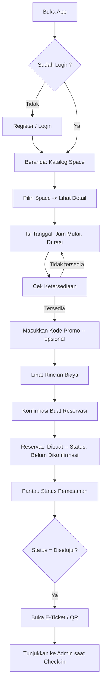
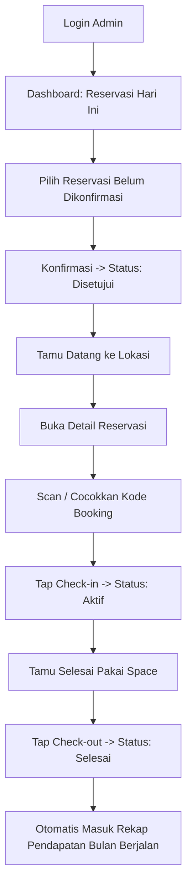
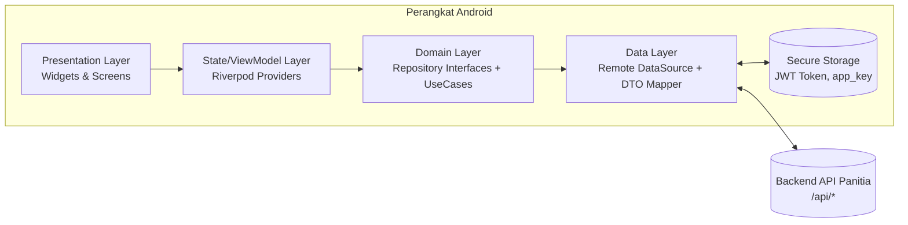
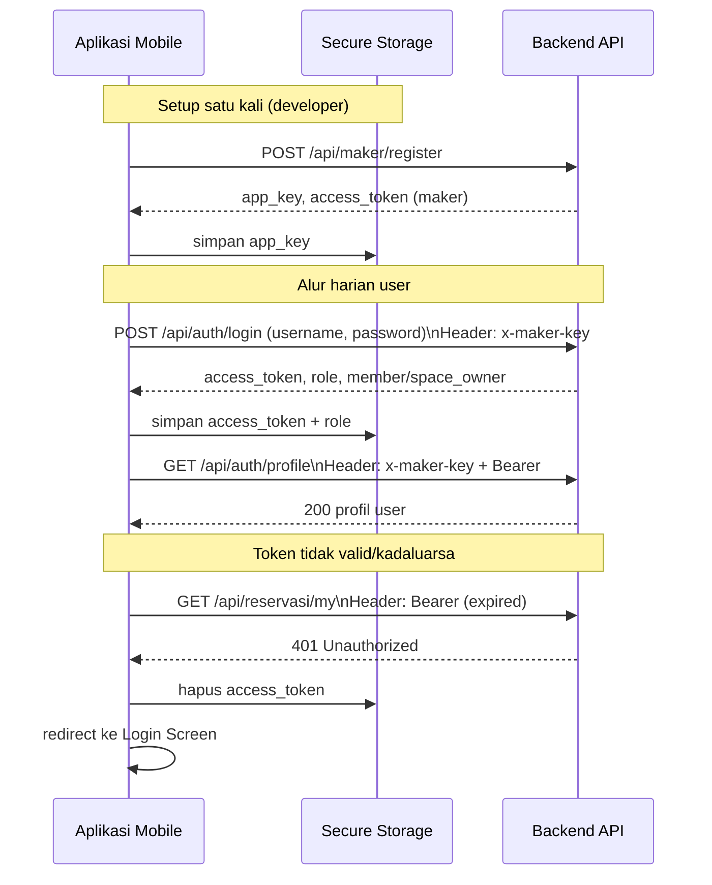
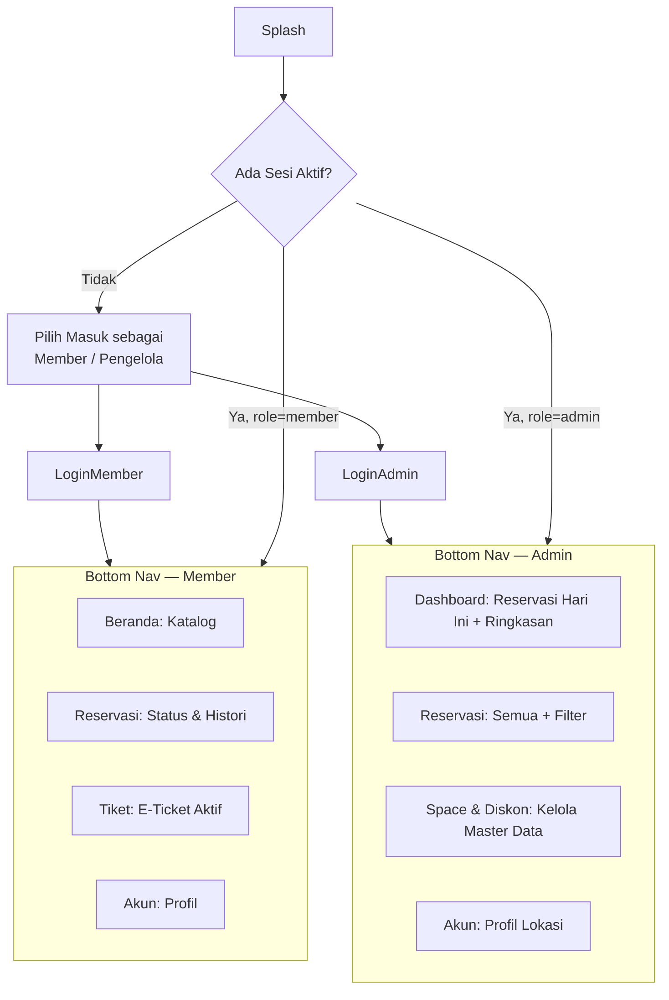

# PRD, ARSITEKTUR & DESAIN — SMART SPACE BOOKING (MOBILE APP)

**Proyek** : Aplikasi Reservasi Coworking Space & Workstation — Kategori Mobile App
**Acuan Soal** : Uji Kompetensi Keahlian RPL 2026/2027 — SMK Telkom Malang, Paket B, Lampiran D
**Versi Dokumen** : 1.0
**Status** : Final untuk pengerjaan ujian

---

## Cara Menggunakan Dokumen Ini

Dokumen ini terdiri atas tiga bagian dan disusun mengikuti urutan kerja nyata: pahami dulu **apa** yang dibangun (PRD), lalu **bagaimana** sistemnya disusun secara teknis (Arsitektur), baru **seperti apa** tampilannya (Desain).

1. **Bagian I — Product Requirements Document**: latar belakang, tujuan, persona, ruang lingkup, dan daftar kebutuhan fungsional/non-fungsional yang jadi acuan penilaian.
2. **Bagian II — Arsitektur Sistem**: keputusan teknis (stack, pola arsitektur, struktur folder, alur data, keamanan) beserta alasannya.
3. **Bagian III — Desain (UI/UX)**: sistem desain konkret (bukan template generik) dan spesifikasi 16 layar (7 Member + 9 Admin) sesuai wireframe pada soal.
4. **Lampiran**: matriks traceability fitur → endpoint API → layar, sebagai checklist pengerjaan.

---

# BAGIAN I: PRODUCT REQUIREMENTS DOCUMENT (PRD)

## 1. Latar Belakang & Problem Statement

Pengelola coworking space saat ini menangani penyewaan ruangan dan meja kerja secara manual — melalui WhatsApp, buku catatan, atau spreadsheet. Pola ini menimbulkan tiga masalah nyata:

| Masalah | Dampak |
|---|---|
| Ketersediaan space tidak real-time | Bentrok jadwal (double booking) antara dua member pada slot jam yang sama |
| Tidak ada bukti reservasi terverifikasi | Petugas front desk sulit memvalidasi tamu saat check-in |
| Pencatatan pendapatan manual | Pengelola tidak punya visibilitas cepat atas pendapatan per jenis space per bulan |

**Smart Space Booking** menjawab tiga masalah ini lewat satu aplikasi mobile dua-peran (Member & Admin) yang terhubung ke satu sumber data (backend API) sehingga status ketersediaan, status pemesanan, dan pendapatan selalu konsisten di kedua sisi.

## 2. Tujuan Produk & Success Metrics

| Tujuan | Metrik Keberhasilan (acuan fungsional, bukan target bisnis) |
|---|---|
| Member bisa memesan space tanpa bentrok jadwal | 100% percobaan reservasi pada slot yang sudah terisi ditolak sistem (respons `400` dari `/api/spaces/availability` atau `/api/reservasi`) |
| Member punya bukti reservasi sah | E-ticket dengan QR code berhasil digenerate untuk setiap reservasi berstatus `disetujui` atau lebih lanjut |
| Admin bisa mengonfirmasi & memproses tamu di lokasi | Alur status `belum_dikonfirm → disetujui → aktif → selesai` dapat dieksekusi penuh dari satu perangkat mobile |
| Admin punya visibilitas pendapatan | Rekapitulasi bulanan (kotor, potongan diskon, bersih, per tipe space) tampil tanpa kalkulasi manual |

## 3. Target Pengguna & Persona

### Persona 1 — Member (Pemesan)
- **Siapa**: Freelancer, mahasiswa tugas akhir, karyawan startup kecil yang butuh tempat kerja fleksibel per jam.
- **Konteks pakai**: Memesan H-1 atau di hari yang sama, sering di jalan menuju lokasi — sehingga alur pemesanan harus cepat (idealnya ≤ 4 langkah dari lihat katalog sampai bayar).
- **Kebutuhan inti**: Kepastian ketersediaan sebelum datang, bukti reservasi yang bisa ditunjukkan ke petugas, riwayat pengeluaran bulanan.

### Persona 2 — Admin Pengelola Space
- **Siapa**: Pemilik atau staf front-desk 1–2 orang yang mengelola satu lokasi coworking.
- **Konteks pakai**: Standby di meja resepsionis, perlu konfirmasi pesanan dan check-in/out tamu dengan cepat sambil melayani tamu walk-in.
- **Kebutuhan inti**: Daftar reservasi hari-ini yang jelas, aksi satu-ketuk untuk ubah status, laporan pendapatan tanpa hitung manual.

## 4. Ruang Lingkup

### 4.1 Dalam Lingkup (In Scope)
Sesuai Lampiran D, aplikasi mobile ini **mengonsumsi API yang disediakan panitia** — tidak membangun backend sendiri. Cakupan fitur mengikuti Bagian II (Gambar Kerja) soal secara penuh:

- Autentikasi dua role (Member, Admin Space) dengan JWT.
- Registrasi App Maker (multi-tenancy) — dilakukan sekali di awal, bukan bagian dari alur harian user.
- Seluruh fitur Member (7 layar): register, login, katalog & ketersediaan space, pemesanan + kode promo, status pemesanan, histori per bulan, e-ticket QR.
- Seluruh fitur Admin (9 layar): register lokasi, login, profil lokasi, CRUD member, CRUD space, CRUD diskon, kelola reservasi (konfirmasi/check-in/check-out), daftar semua reservasi dengan filter, rekapitulasi pendapatan bulanan.

### 4.2 Luar Lingkup (Out of Scope)
- Pembayaran online (gateway pembayaran) — nilai `total_bayar` bersifat informatif, pelunasan dilakukan di lokasi (sesuai kontrak API yang tidak menyediakan endpoint payment gateway).
- Notifikasi push real-time (tidak ada endpoint/websocket untuk ini di Kontrak API).
- Multi-lokasi dalam satu akun admin (satu akun admin = satu `space_owner`, sesuai ERD `space_owner 1—N space`).
- Mode offline penuh (baca §8.9 Bagian II untuk strategi minimal yang tetap disediakan).

## 5. Kebutuhan Fungsional

Diberi ID `FR-xx` agar bisa ditelusuri ke endpoint API dan layar pada Lampiran (Bagian akhir dokumen).

### 5.1 Modul Autentikasi & Onboarding

| ID | Kebutuhan | Role | Prioritas |
|---|---|---|---|
| FR-01 | Sistem dapat mendaftarkan akun App Maker sekali di awal pengembangan untuk mendapatkan `app_key` | Developer (setup) | Wajib |
| FR-02 | Member dapat mendaftar akun dengan nama, instansi, telepon, alamat, username, password, foto profil | Member | Wajib |
| FR-03 | Calon pengelola dapat mendaftarkan lokasi coworking dan akun admin | Admin | Wajib |
| FR-04 | User dapat login dan sistem menyimpan sesi (JWT) sampai logout eksplisit | Member/Admin | Wajib |
| FR-05 | Sistem menampilkan pesan error yang jelas saat kredensial salah, tanpa membocorkan apakah username atau password yang salah | Member/Admin | Wajib |

### 5.2 Modul Katalog & Ketersediaan Space (Member)

| ID | Kebutuhan | Prioritas |
|---|---|---|
| FR-06 | Member dapat melihat daftar space dengan foto, tipe, kapasitas, fasilitas, harga per jam | Wajib |
| FR-07 | Member dapat memfilter katalog berdasarkan tipe (Personal Desk / Meeting Room / Private Office) dan pencarian nama | Wajib |
| FR-08 | Member dapat mengecek ketersediaan space pada tanggal & jam tertentu **sebelum** menekan tombol pesan, agar tahu bentrok lebih awal | Wajib |
| FR-09 | Sistem menghitung estimasi total biaya secara otomatis berdasarkan durasi × harga per jam, sebelum diskon | Wajib |

### 5.3 Modul Reservasi (Member)

| ID | Kebutuhan | Prioritas |
|---|---|---|
| FR-10 | Member dapat memasukkan kode promo dan sistem memvalidasi + menghitung potongan sebelum reservasi final dibuat | Wajib |
| FR-11 | Member dapat membuat reservasi dengan pilihan tanggal, jam mulai, durasi jam | Wajib |
| FR-12 | Sistem menampilkan rincian: subtotal, potongan diskon, total bayar sebelum konfirmasi akhir | Wajib |
| FR-13 | Member dapat melihat status semua pemesanannya dengan 5 kemungkinan status: Belum Dikonfirmasi, Disetujui, Aktif/Digunakan, Selesai, Dibatalkan | Wajib |
| FR-14 | Member dapat memfilter histori pemesanan berdasarkan bulan | Wajib |
| FR-15 | Member dapat membatalkan pemesanan yang belum aktif | Wajib |
| FR-16 | Member dapat menampilkan e-ticket berisi kode reservasi dan QR code untuk check-in di lokasi | Wajib |

### 5.4 Modul Profil & Master Data (Admin)

| ID | Kebutuhan | Prioritas |
|---|---|---|
| FR-17 | Admin dapat melihat dan memperbarui profil lokasi (nama space, pemilik, alamat, telepon, deskripsi) | Wajib |
| FR-18 | Admin dapat melakukan CRUD data member (tambah, lihat, ubah, hapus), termasuk upload foto | Wajib |
| FR-19 | Admin dapat melakukan CRUD data space: nama, tipe, kapasitas, harga per jam, deskripsi fasilitas, foto | Wajib |
| FR-20 | Admin dapat melakukan CRUD kode promo/diskon: nama, persentase, tanggal awal-akhir berlaku | Wajib |

### 5.5 Modul Operasional Reservasi (Admin)

| ID | Kebutuhan | Prioritas |
|---|---|---|
| FR-21 | Admin dapat melihat seluruh reservasi masuk dengan filter status, bulan, tahun, space, dan tanggal spesifik | Wajib |
| FR-22 | Admin dapat mengonfirmasi/mengubah status pesanan (`disetujui`, `dibatalkan`, dst.) | Wajib |
| FR-23 | Admin dapat melakukan check-in tamu (status → `aktif`) dan check-out (status → `selesai`) dari satu layar detail reservasi | Wajib |
| FR-24 | Admin dapat melihat rekap pendapatan bulanan: total transaksi, jam terpakai, pendapatan kotor, potongan diskon, pendapatan bersih, dan distribusi per tipe space | Wajib |

## 6. Kebutuhan Non-Fungsional

| Kategori | Kebutuhan |
|---|---|
| **Performa** | Daftar space dan daftar reservasi harus menampilkan *skeleton loading*, bukan layar kosong/blank, selama menunggu respons API. Time-to-interactive katalog space < 2 detik pada jaringan 4G normal. |
| **Keandalan** | Semua request API menyertakan *timeout* 15 detik dan retry manual (tombol "Coba Lagi"), karena kondisi Wi-Fi lokasi ujian/coworking bisa tidak stabil. |
| **Keamanan** | Token JWT disimpan di secure storage terenkripsi perangkat, bukan `SharedPreferences`/plain storage. `app_key` tidak pernah ditampilkan penuh di UI setelah setup awal. |
| **Kompatibilitas** | Minimum Android 10 (API 29) sesuai spesifikasi alat pada soal; target SDK mengikuti versi Flutter/Android Studio stabil terbaru saat pengerjaan. |
| **Aksesibilitas** | Kontras warna teks-latar minimal rasio 4.5:1 (AA), target sentuh minimal 44×44dp untuk semua tombol aksi. |
| **Auditability** | Setiap perubahan status reservasi oleh Admin harus menampilkan konfirmasi (dialog) sebelum dikirim, untuk mencegah salah ketuk pada aksi yang tidak bisa dibatalkan (check-out). |

## 7. User Flow Utama

### 7.1 Alur Member — Reservasi Space



### 7.2 Alur Admin — Konfirmasi & Check-in/Check-out



## 8. Asumsi & Batasan

- **Asumsi**: Base URL dan dokumentasi API final akan diberikan panitia saat ujian dimulai; sebelum itu pengembangan dilakukan terhadap kontrak API di dokumen soal (bukan server yang benar-benar aktif).
- **Asumsi**: Nilai `total_bayar`, `jam_selesai`, dan `potongan_diskon` **dihitung oleh backend**, bukan oleh aplikasi mobile — mobile hanya menampilkan hasil dari respons API agar tidak ada selisih perhitungan antara Member dan Admin.
- **Batasan**: Karena tidak ada endpoint refresh token pada Kontrak API, aplikasi harus mengarahkan user ke layar login ulang saat menerima `401 Unauthorized`, bukan mencoba memperbarui token secara diam-diam.
- **Batasan**: Foto (space, member) diunggah lebih dulu lewat endpoint `/api/upload/*` untuk mendapatkan `filename`, baru nama file tersebut dikirim sebagai field `foto` pada payload create/update — bukan file biner langsung di body JSON.

## 9. Risiko & Mitigasi

| Risiko | Mitigasi |
|---|---|
| Dua member memesan slot yang sama nyaris bersamaan (race condition) | UI selalu memanggil `/api/spaces/availability` ulang tepat sebelum submit `POST /api/reservasi`, dan menampilkan pesan spesifik dari response `400` bila ternyata sudah terisi. |
| App key hilang/lupa dicatat | Simpan `app_key` di secure storage segera setelah `POST /api/maker/register`, dan sediakan layar "Info Developer" read-only untuk menampilkannya kembali via `GET /api/maker/me`. |
| Admin tidak sengaja check-out reservasi yang salah | Wajib dialog konfirmasi + tampilkan nama member & kode booking sebelum aksi `check-out` dikirim. |

---

# BAGIAN II: ARSITEKTUR SISTEM

## 1. Gambaran Arsitektur

Sistem berupa **arsitektur client-server terpisah murni**: aplikasi mobile tidak menyimpan data sendiri sebagai sumber kebenaran (*source of truth*) — semua data tetap di backend panitia. Aplikasi hanya melakukan caching sementara di memori untuk pengalaman yang lebih mulus.



**Prinsip kunci**: setiap layer hanya boleh bicara dengan layer tepat di bawahnya (*strict layering*). `Presentation` tidak pernah memanggil `Data` langsung — ini membuat aplikasi bisa diuji (testable) dan mudah diganti sumber datanya (mis. saat panitia mengganti base URL saat ujian, cukup ubah satu file konfigurasi).

## 2. Tech Stack & Justifikasi

| Komponen | Pilihan | Alasan |
|---|---|---|
| Framework | **Flutter (Dart)** | Satu codebase untuk build cepat dalam durasi ujian praktik yang terbatas; hot reload mempercepat iterasi UI sesuai wireframe. |
| State Management | **Riverpod** | Tidak bergantung `BuildContext` untuk akses state (beda dari Provider klasik), lebih aman dari bug "provider not found", dan cocok dipadu dengan lapisan Repository murni Dart. |
| HTTP Client | **Dio** | Mendukung *interceptor* bawaan untuk menyisipkan header `x-maker-key` dan `Authorization: Bearer` secara otomatis ke **setiap** request tanpa ditulis ulang di setiap pemanggilan API. |
| Local Secure Storage | **flutter_secure_storage** | Menyimpan JWT dan `app_key` terenkripsi di Keystore (Android), sesuai kebutuhan non-fungsional keamanan (§6 Bagian I). |
| Routing | **go_router** | Deep-linkable, mendukung *route guard* untuk redirect otomatis ke layar login saat token tidak valid. |
| Image Loading | **cached_network_image** | Foto space/member di-cache lokal agar katalog tidak "flicker" saat scroll dan hemat kuota saat reservasi ulang space yang sama. |
| Form & Validasi | **flutter_form_builder + form_builder_validators** | Validasi konsisten untuk field wajib (register, tambah member, tambah space) tanpa boilerplate manual berulang. |
| QR Code | **qr_flutter** | Merender `qr_code_payload` dari respons `GET /api/reservasi/{id}/e-ticket` menjadi QR yang bisa dipindai admin. |

## 3. Pola Arsitektur Aplikasi — Clean Architecture (3 Lapis)

```
lib/
├── core/                         # Lintas fitur, tidak spesifik satu domain
│   ├── network/
│   │   ├── dio_client.dart       # Setup Dio + interceptor header
│   │   └── api_endpoints.dart    # Konstanta path endpoint (satu sumber kebenaran)
│   ├── storage/
│   │   └── secure_storage_service.dart
│   ├── errors/
│   │   ├── failure.dart          # Representasi error terstruktur, bukan Exception mentah
│   │   └── exception_mapper.dart # Ubah DioException -> Failure sesuai format {status,message,error}
│   └── theme/
│       ├── app_colors.dart
│       ├── app_typography.dart
│       └── app_spacing.dart
│
├── features/
│   ├── auth/
│   │   ├── data/
│   │   │   ├── models/           # LoginRequestModel, UserModel (mapping 1:1 ke DTO soal)
│   │   │   └── auth_remote_datasource.dart
│   │   ├── domain/
│   │   │   ├── entities/         # User, MemberProfile, AdminProfile
│   │   │   ├── repositories/     # AuthRepository (interface)
│   │   │   └── usecases/         # LoginUseCase, RegisterMemberUseCase, dst.
│   │   └── presentation/
│   │       ├── providers/        # authControllerProvider (Riverpod)
│   │       └── screens/          # login_screen.dart, register_screen.dart
│   │
│   ├── space_catalog/            # FR-06 s.d. FR-09
│   ├── reservation/               # FR-10 s.d. FR-16
│   ├── e_ticket/                  # FR-16
│   ├── admin_profile/             # FR-17
│   ├── admin_member/              # FR-18
│   ├── admin_space/                # FR-19
│   ├── admin_discount/             # FR-20
│   ├── admin_reservation/          # FR-21 s.d. FR-23
│   └── admin_report/               # FR-24
│
└── main.dart
```

**Alasan struktur per-fitur (bukan per-jenis-file)**: soal memiliki dua role dengan modul yang jelas terpisah (7 layar Member, 9 layar Admin). Struktur *feature-first* membuat setiap modul bisa dikerjakan dan diuji independen — penting saat waktu ujian terbatas dan pengerjaan berjalan berurutan sesuai Langkah Kerja Lampiran D.

## 4. Manajemen State

Tiga jenis state dipisah eksplisit agar tidak tercampur:

| Jenis State | Contoh | Penanganan |
|---|---|---|
| **State Sesi (Global)** | Status login, role aktif (`member`/`admin_space`), token | `authControllerProvider` — `AsyncNotifier` tunggal, dibaca `go_router` sebagai *redirect guard*. |
| **State Data per Layar** | Daftar space, detail reservasi, hasil cek ketersediaan | `FutureProvider.family` / `AsyncNotifier` per fitur — otomatis punya state `loading`/`data`/`error` bawaan Riverpod, dipetakan langsung ke UI tanpa flag boolean manual. |
| **State Form (Lokal)** | Input tanggal/jam/durasi saat membuat reservasi | `StateProvider` lokal di dalam screen, di-*dispose* otomatis saat layar ditutup — tidak membebani state global. |

Prinsip: **UI hanya boleh berupa fungsi dari state** — tidak ada `setState` manual yang menyimpan hasil kalkulasi bisnis (mis. total bayar). Semua angka finansial ditampilkan langsung dari field respons API (`total_harga_awal`, `potongan_diskon`, `total_bayar`) sesuai batasan di §8 Bagian I.

## 5. Lapisan Jaringan — Interceptor Header Otomatis

Karena **setiap** endpoint pada Kontrak API mensyaratkan header `x-maker-key`, dan sebagian besar juga mensyaratkan `Authorization: Bearer`, header ini **tidak** ditulis manual di setiap pemanggilan API — melainkan disisipkan otomatis lewat satu `Interceptor` terpusat:

```dart
class ApiHeaderInterceptor extends Interceptor {
  final SecureStorageService storage;
  ApiHeaderInterceptor(this.storage);

  @override
  void onRequest(RequestOptions options, RequestInterceptorHandler handler) async {
    final appKey = await storage.readAppKey();
    final token = await storage.readAccessToken();

    if (appKey != null) options.headers['x-maker-key'] = appKey;
    if (token != null) options.headers['Authorization'] = 'Bearer $token';

    handler.next(options);
  }

  @override
  void onError(DioException err, ErrorInterceptorHandler handler) async {
    if (err.response?.statusCode == 401) {
      await storage.clearSession();
      // Publish event supaya router redirect ke /login, bukan retry diam-diam
    }
    handler.next(err);
  }
}
```

Dengan pola ini, endpoint publik (mis. `GET /api/spaces`) tetap mendapat `x-maker-key` (dibutuhkan untuk isolasi data multi-tenancy), sedangkan endpoint yang butuh login otomatis mendapat tambahan header `Authorization` — sesuai Ketentuan Global poin 1 & 2 pada Kontrak API.

## 6. Manajemen Autentikasi & Sesi



Dua nilai disimpan terpisah di secure storage: **`app_key`** (permanen, milik developer/App Maker — dibuat sekali) dan **`access_token`** (per sesi user — dihapus saat logout atau saat menerima `401`). Field `role` dari respons login (`member` / `admin_space`) menentukan *route guard* mana yang dibuka `go_router` — mencegah member membuka layar admin dan sebaliknya, walau URL rute diketik langsung.

## 7. Model Data & Mapping DTO

Model Dart dibuat **field-per-field mengikuti DTO di Kontrak API**, bukan disederhanakan — supaya perubahan status/harga dari backend selalu tercermin tanpa transformasi tersembunyi. Contoh untuk entitas inti:

```dart
class ReservasiModel {
  final int id;
  final String kodeBooking;
  final int idMember;
  final int idSpace;
  final int? idDiskon;
  final DateTime tanggalReservasi;
  final String jamMulai;      // "HH:mm" — disimpan sebagai String, bukan DateTime,
  final String jamSelesai;    // karena kontrak API tidak menyertakan tanggal di jam
  final int durasiJam;
  final int hargaPerJam;
  final int totalHargaAwal;
  final int potonganDiskon;
  final int totalBayar;
  final ReservasiStatus status; // enum, lihat mapping di bawah

  factory ReservasiModel.fromJson(Map<String, dynamic> json) => ReservasiModel(
    id: json['id'],
    kodeBooking: json['kode_booking'],
    idMember: json['id_member'],
    idSpace: json['id_space'],
    idDiskon: json['id_diskon'],
    tanggalReservasi: DateTime.parse(json['tanggal_reservasi']),
    jamMulai: json['jam_mulai'],
    jamSelesai: json['jam_selesai'],
    durasiJam: json['durasi_jam'],
    hargaPerJam: json['harga_per_jam'],
    totalHargaAwal: json['total_harga_awal'],
    potonganDiskon: json['potongan_diskon'],
    totalBayar: json['total_bayar'],
    status: ReservasiStatus.fromApi(json['status']),
  );
}

enum ReservasiStatus {
  belumDikonfirm, disetujui, aktif, selesai, dibatalkan;

  static ReservasiStatus fromApi(String value) => switch (value) {
    'belum_dikonfirm' => ReservasiStatus.belumDikonfirm,
    'disetujui'        => ReservasiStatus.disetujui,
    'aktif'             => ReservasiStatus.aktif,
    'selesai'           => ReservasiStatus.selesai,
    'dibatalkan'        => ReservasiStatus.dibatalkan,
    _ => throw FormatException('Status tidak dikenal: $value'),
  };
}
```

`enum` untuk status dipakai (bukan `String` mentah) agar Dart *compiler* memaksa setiap `switch` UI (warna badge, aksi yang boleh ditekan) menangani seluruh 5 kemungkinan status — mencegah lupa menangani satu status di suatu layar.

## 8. Strategi Penanganan Error

Semua error API mengikuti format baku pada Ketentuan Global poin 3 (`{status:false, statusCode, message, error}`). Lapisan data mengubah ini menjadi tipe `Failure` yang seragam agar UI tidak pernah membaca `response.data['message']` secara langsung di dalam widget:

| Kondisi | Failure Type | Perilaku UI |
|---|---|---|
| `400 Bad Request` (mis. space bentrok jadwal) | `ValidationFailure(message)` | Tampilkan pesan `message` dari API persis apa adanya di dekat elemen form terkait (inline, bukan snackbar generik). |
| `401 Unauthorized` | `SessionExpiredFailure` | Hapus sesi, redirect ke Login, tampilkan banner "Sesi berakhir, silakan login kembali". |
| `404 Not Found` | `NotFoundFailure` | Tampilkan state kosong khusus, bukan error merah — mis. reservasi yang dibatalkan admin lalu dibuka lagi oleh member. |
| Tidak ada koneksi / timeout | `NetworkFailure` | Tampilkan ilustrasi offline + tombol "Coba Lagi", bukan pesan teknis Dio. |
| `500 Server Error` | `ServerFailure` | Tampilkan pesan umum "Server sedang bermasalah", sertakan tombol Coba Lagi. |

## 9. Ketersediaan Terbatas (Offline-Aware, Bukan Offline-First)

Aplikasi ini **tidak** dirancang offline-first (data reservasi harus selalu akurat real-time — tidak boleh ada risiko dua member menyimpan reservasi bentrok karena data basi). Yang tetap disediakan untuk ketahanan jaringan:

- **Cache gambar** (space & member) via `cached_network_image` agar katalog tetap bisa di-scroll walau koneksi sempat putus.
- **Cache ringan hasil `GET` terakhir** (in-memory, bukan disk) di provider Riverpod selama sesi aplikasi berjalan, supaya berpindah tab bottom navigation tidak memicu re-fetch berulang dalam hitungan detik.
- **E-ticket yang sudah dibuka sekali** disimpan di memori selama sesi, karena e-ticket sering perlu ditunjukkan berulang saat menunggu antrean check-in.

## 10. Keamanan

- Token JWT dan `app_key` **hanya** di `flutter_secure_storage`, tidak pernah di-log ke console pada build release (`kReleaseMode` guard pada semua `print`/`log`).
- Field `password` tidak pernah disimpan di state aplikasi setelah request login/register terkirim — hanya hidup sesaat di `TextEditingController` form.
- Validasi input dilakukan di sisi client (format email/nomor telepon, panjang password ≥ 6 sesuai DTO) **sebagai UX**, bukan sebagai satu-satunya lapisan keamanan — validasi akhir tetap milik backend.
- Upload foto memakai endpoint khusus (`/api/upload/members`, `/api/upload/spaces`) sebelum data form dikirim, sehingga file biner tidak pernah ikut ter-serialize ke dalam body JSON.

---

# BAGIAN III: DESAIN (UI/UX)

## 1. Prinsip Desain & Brand Personality

Coworking space menjual **rasa nyaman untuk fokus bekerja di ruang bersama** — bukan kesan korporat kaku, dan bukan pula kesan "startup generik" (gradasi ungu-biru yang sudah terlalu sering dipakai). Tiga prinsip yang memandu setiap keputusan visual di bawah:

1. **Hangat, bukan dingin** — palet warna mengambil inspirasi dari material fisik coworking space sungguhan: kayu, bata ekspos, tanaman hijau. Bukan biru korporat.
2. **Jelas status, di manapun mata jatuh** — karena inti aplikasi ini adalah *status* (ketersediaan, status pemesanan, status pembayaran), warna status harus konsisten dan bisa dikenali tanpa membaca teks (untuk admin yang bekerja cepat di meja depan).
3. **Kepadatan informasi terkendali** — data finansial (rincian harga, rekap pendapatan) ditata dengan hierarki tipografi yang jelas, bukan dijejalkan dalam tabel kecil yang sulit dibaca di layar ponsel.

## 2. Design System

### 2.1 Palet Warna

| Token | Hex | Penggunaan |
|---|---|---|
| `ink-900` | `#1C1917` | Teks utama (bukan hitam pekat `#000` — lebih lembut di mata) |
| `ink-600` | `#57534E` | Teks sekunder, label |
| `ink-300` | `#A8A29E` | Placeholder, teks nonaktif |
| `surface-0` | `#FFFFFF` | Latar kartu |
| `surface-50` | `#FAF9F7` | Latar layar (warm off-white, bukan `#F5F5F5` abu dingin) |
| `border` | `#E7E3DE` | Garis pembatas, divider |
| **`primary` (Ember)** | `#C2540E` | Aksi utama (tombol pesan, konfirmasi) — terakota hangat, terinspirasi bata ekspos coworking |
| `primary-container` | `#FBE7D8` | Latar chip/badge primer |
| **`secondary` (Deep Teal)** | `#0E5C56` | Elemen navigasi aktif, ikon informasi — warna tenang untuk kontras dari Ember |
| `secondary-container` | `#DCEEEC` | Latar info non-status |
| `success` | `#2F7A4D` | Status *Selesai*, konfirmasi berhasil |
| `warning` | `#B8860B` | Status *Belum Dikonfirmasi* |
| `info` | `#1D6FA5` | Status *Aktif/Digunakan* |
| `danger` | `#B3261E` | Status *Dibatalkan*, error, aksi destruktif |

> Alasan tidak memakai palet biru-ungu default: warna itu sudah menjadi "default AI/startup template" dan tidak mencerminkan karakter fisik ruang kerja bersama. Terakota + teal memberi kontras hangat-sejuk yang jarang dipakai aplikasi sejenis, sekaligus tetap memenuhi rasio kontras AA terhadap `surface-50` dan `ink-900`.

### 2.2 Tipografi

| Peran | Font | Ukuran / Weight |
|---|---|---|
| Judul Layar (H1) | **Sora**, SemiBold | 24sp |
| Judul Kartu (H2) | Sora, SemiBold | 18sp |
| Label Section | Sora, Medium | 13sp, letter-spacing +0.4, UPPERCASE |
| Body | **Inter**, Regular | 15sp |
| Body Kecil / Caption | Inter, Regular | 13sp |
| Angka Finansial (harga, total) | **Inter**, SemiBold, *tabular-nums* | 16–20sp tergantung konteks |

**Alasan pemilihan pasangan Sora + Inter**: Sora punya karakter geometris yang sedikit "hangat" di sudut hurufnya (cocok untuk judul, memberi kepribadian), sementara Inter dioptimalkan untuk keterbacaan angka dan teks padat di layar kecil (cocok untuk body dan tabel rincian harga) — kombinasi yang lebih spesifik dibanding memakai satu font sistem default di semua tempat.

### 2.3 Skala Spasi (grid 4px)

`4 · 8 · 12 · 16 · 24 · 32 · 48 · 64` — dipakai konsisten untuk padding, gap antar elemen, dan margin section, agar layar terasa memiliki *ritme* yang sama meski dikerjakan lintas fitur oleh alur kerja berbeda.

### 2.4 Radius & Elevasi

| Elemen | Radius | Elevasi/Shadow |
|---|---|---|
| Card space, card reservasi | 16dp | `shadow: 0 2 8 rgba(28,25,23,0.06)` — bayangan lembut warm-tinted, bukan abu netral |
| Tombol primer/sekunder | 12dp | Tanpa shadow saat idle, elevasi tipis saat *pressed* |
| Chip status (badge) | 999dp (pill) | Tanpa shadow |
| Bottom sheet (form reservasi, filter) | 24dp (top corners) | `shadow: 0 -4 16 rgba(28,25,23,0.10)` |

### 2.5 Komponen Kunci

**a. Status Badge** — komponen dipakai berulang di 6+ layar, jadi didefinisikan sekali:

| Status | Label UI | Warna Latar | Warna Teks | Ikon |
|---|---|---|---|---|
| `belum_dikonfirm` | Menunggu Konfirmasi | `warning` 12% opacity | `warning` | jam pasir |
| `disetujui` | Disetujui | `secondary-container` | `secondary` | centang lingkar |
| `aktif` | Sedang Digunakan | `info` 12% opacity | `info` | pin lokasi |
| `selesai` | Selesai | `success` 12% opacity | `success` | centang ganda |
| `dibatalkan` | Dibatalkan | `danger` 10% opacity | `danger` | silang lingkar |

**b. Space Card (katalog)** — foto 4:3 di atas, judul + tipe (chip kecil) di bawahnya, harga per jam rata kanan dengan format `Rp XX.XXX/jam` menggunakan Inter SemiBold tabular agar angka sejajar antar-kartu saat di-scroll.

**c. Kalkulator Rincian Biaya (bottom sheet form reservasi)** — tiga baris tetap: `Subtotal`, `Potongan Diskon` (warna `primary` bila terisi, disembunyikan bila 0), `Total Bayar` (paling tebal, 20sp) — meniru pola struk fisik yang familiar bagi user awam finansial.

**d. Kartu Rekapitulasi Pendapatan (Admin)** — satu angka besar "Pendapatan Bersih Bulan Ini" di atas, diikuti *stacked bar* horizontal proporsional per tipe space (Personal Desk / Meeting Room / Private Office) memakai warna `primary`, `secondary`, dan `info` masing-masing — dipilih agar tiga tipe space punya identitas warna konsisten di semua layar admin, bukan warna acak per-chart.

## 3. Struktur Navigasi (Information Architecture)



Bottom navigation 4-tab dipilih untuk kedua role (bukan drawer/hamburger menu) karena konteks pakai keduanya adalah **aksi cepat berulang**, bukan eksplorasi menu — hamburger menu menambah satu ketukan ekstra yang tidak perlu untuk tugas seperti check-in tamu yang sedang menunggu.

## 4. Spesifikasi Layar — Member (7 Layar)

| # | Layar | Tujuan | Elemen Kunci | Endpoint Terkait |
|---|---|---|---|---|
| M1 | **Register Akun** | Member baru mendaftar | Form: nama lengkap, instansi (opsional), telepon, alamat, username, password, konfirmasi password, upload foto profil, checkbox S&K | `POST /api/upload/members` (foto) → `POST /api/auth/register/member` |
| M2 | **Login** | Masuk ke akun | Form username/password, link "Lupa Password" (nonaktif — tidak ada endpoint reset di Kontrak API, tampilkan sebagai *disabled* dengan tooltip, bukan tombol mati tanpa penjelasan) | `POST /api/auth/login` |
| M3 | **Ketersediaan Space** (Beranda) | Jelajahi katalog | Search bar, tab filter tipe (Semua/Personal Desk/Private Office/Meeting Room), grid Space Card, badge lokasi/kota di header | `GET /api/spaces/types`, `GET /api/spaces?tipe=&search=` |
| M4 | **Pesan Space** | Detail + form reservasi | Galeri foto, info kapasitas & fasilitas, date picker, time picker, stepper durasi jam, field kode promo + tombol "Terapkan", ringkasan biaya, tombol "Cek Ketersediaan" sebelum tombol final "Lanjutkan" | `GET /api/spaces/{id}`, `GET /api/spaces/availability`, `POST /api/diskon/check`, `POST /api/reservasi` |
| M5 | **Status Pemesanan** | Pantau semua reservasi aktif/lampau | Tab filter status (Semua/Belum Dikonfirmasi/Disetujui/Aktif), list card dengan Status Badge, tombol "Batalkan" muncul hanya untuk status yang masih boleh dibatalkan | `GET /api/reservasi/my`, `PATCH /api/reservasi/{id}/cancel` |
| M6 | **Histori Pemesanan** | Rekap pengeluaran bulanan | Selector bulan-tahun, kartu ringkasan (total reservasi, total pengeluaran), list riwayat ringkas | `GET /api/reservasi/my/history?month=&year=` |
| M7 | **E-Ticket / Bukti Reservasi** | Bukti check-in di lokasi | QR code besar di tengah, kode booking, rincian jadwal & pembayaran, tombol Unduh (simpan sebagai gambar) dan Bagikan | `GET /api/reservasi/{id}/e-ticket` |

**Detail interaksi M4 (layar paling kompleks)**: tombol "Lanjutkan" **nonaktif** sampai hasil cek ketersediaan bernilai `available: true` untuk kombinasi tanggal/jam/durasi yang sedang dipilih — mencegah member submit reservasi yang pasti ditolak backend, sesuai FR-08.

## 5. Spesifikasi Layar — Admin (9 Layar)

| # | Layar | Tujuan | Elemen Kunci | Endpoint Terkait |
|---|---|---|---|---|
| A1 | **Register Admin/Pengelola** | Daftar lokasi baru | Form: nama coworking, nama pemilik, telepon, username, password, konfirmasi | `POST /api/auth/register/admin-space` |
| A2 | **Login Admin** | Masuk sebagai pengelola | Sama pola dengan M2, dibedakan lewat toggle role di Role Picker awal | `POST /api/auth/login` |
| A3 | **Profil Lokasi** | Kelola identitas coworking | Form read/edit: nama coworking, nama pemilik, telepon, deskripsi fasilitas, tombol "Simpan Perubahan" | `GET /api/admin/profile`, `PUT /api/admin/profile` |
| A4 | **Data Member (CRUD)** | Kelola pelanggan terdaftar | Search bar, list member dengan avatar + kontak, swipe/ikon edit & hapus, FAB tambah member baru → form lengkap dengan upload foto | `GET/POST/PUT/DELETE /api/admin/members` |
| A5 | **Data Space (CRUD)** | Kelola inventaris ruangan/meja | Grid card space (mirror tampilan M3 tapi dengan aksi edit/hapus), FAB tambah space → form nama, tipe (dropdown 3 pilihan), kapasitas, harga per jam, deskripsi fasilitas, upload foto | `GET/POST/PUT/DELETE /api/admin/spaces`, `POST /api/upload/spaces` |
| A6 | **Data Diskon/Promo (CRUD)** | Kelola kode promo | List kode promo dengan chip persentase besar + rentang tanggal berlaku, indikator "Aktif"/"Kedaluwarsa" berdasarkan tanggal hari ini vs `tanggal_akhir`, FAB tambah promo | `GET/POST/PUT/DELETE /api/admin/diskon` |
| A7 | **Kelola Reservasi (Detail)** | Aksi operasional per reservasi | Detail lengkap member + space + jadwal + rincian biaya, dropdown ubah status (dengan dialog konfirmasi), tombol besar "Check-in" (muncul saat status `disetujui`) dan "Check-out" (muncul saat status `aktif`) | `GET /api/reservasi/{id}`, `PATCH /api/admin/reservasi/{id}/status`, `POST /api/admin/reservasi/{id}/check-in`, `POST /api/admin/reservasi/{id}/check-out` |
| A8 | **Semua Reservasi (Filter Bulan)** | Daftar & pencarian reservasi | Selector bulan-tahun, chip filter status, chip filter per space, list card (tap → buka A7) | `GET /api/admin/reservasi?month=&year=&status=&id_space=&tanggal=` |
| A9 | **Rekapitulasi Pendapatan** | Laporan finansial bulanan | Selector bulan-tahun, kartu angka besar "Pendapatan Bersih", grafik garis tren harian (bila data tersedia), stacked bar per tipe space, tabel ringkas jumlah booking & jam terpakai | `GET /api/admin/reports/monthly?month=&year=` |

**Detail interaksi A7 (layar paling sensitif)**: setiap aksi *check-in* dan *check-out* memicu `AlertDialog` yang menampilkan nama member dan kode booking sebelum konfirmasi (lihat mitigasi risiko §9 Bagian I) — ini satu-satunya aksi di seluruh aplikasi yang **wajib** dua langkah ketuk, karena tidak ada endpoint untuk membatalkan status check-out setelah terkirim.

## 6. State Kosong, Loading, dan Error per Konteks

Konsisten di semua layar list (M5, M6, A4, A5, A6, A8):

| State | Perlakuan Visual |
|---|---|
| **Loading pertama kali** | Skeleton shimmer berbentuk sama seperti card asli (bukan spinner tunggal di tengah layar) — mempertahankan tata letak agar tidak ada "lompatan" konten saat data datang. |
| **Kosong (data memang belum ada)** | Ilustrasi garis sederhana + teks kontekstual, mis. "Belum ada reservasi bulan ini" (M6) — bukan pesan generik "No Data". |
| **Error jaringan** | Ilustrasi + tombol "Coba Lagi" memanggil ulang provider yang sama, mempertahankan filter yang sedang aktif (tidak mereset ke default). |
| **Hasil pencarian/filter kosong** | Berbeda dari "kosong data" — teks "Tidak ditemukan hasil untuk '...' " agar user tahu ini soal query, bukan sistem kosong. |

## 7. Aksesibilitas

- Semua Status Badge memakai **ikon + warna + teks** bersamaan (bukan warna saja) — memenuhi prinsip "jangan hanya andalkan warna" untuk pengguna buta warna.
- Ukuran font mengikuti skala `sp` (bukan `px` tetap), sehingga menghormati pengaturan ukuran teks sistem Android milik user.
- Target sentuh tombol aksi utama (Check-in, Check-out, Batalkan, Lanjutkan) minimal 48×48dp, sesuai kebutuhan non-fungsional §6 Bagian I.
- Kontras `ink-900` di atas `surface-50` = rasio ±13:1, jauh di atas ambang AA 4.5:1 — dites eksplisit karena warna terakota (`primary`) di atas latar terang mudah jatuh di bawah ambang bila tidak dicek.

---

# LAMPIRAN: Matriks Traceability Fitur → Endpoint → Layar

| FR | Fitur Singkat | Endpoint API | Layar |
|---|---|---|---|
| FR-02 | Register member | `POST /api/auth/register/member` | M1 |
| FR-03 | Register admin | `POST /api/auth/register/admin-space` | A1 |
| FR-04 | Login | `POST /api/auth/login` | M2 / A2 |
| FR-06, FR-07 | Katalog & filter space | `GET /api/spaces/types`, `GET /api/spaces` | M3 |
| FR-08 | Cek ketersediaan | `GET /api/spaces/availability` | M4 |
| FR-10 | Validasi kode promo | `POST /api/diskon/check` | M4 |
| FR-11, FR-12 | Buat reservasi | `POST /api/reservasi` | M4 |
| FR-13 | Status pemesanan | `GET /api/reservasi/my` | M5 |
| FR-14 | Histori per bulan | `GET /api/reservasi/my/history` | M6 |
| FR-15 | Batalkan reservasi | `PATCH /api/reservasi/{id}/cancel` | M5 |
| FR-16 | E-ticket QR | `GET /api/reservasi/{id}/e-ticket` | M7 |
| FR-17 | Profil lokasi | `GET/PUT /api/admin/profile` | A3 |
| FR-18 | CRUD member | `GET/POST/PUT/DELETE /api/admin/members` | A4 |
| FR-19 | CRUD space | `GET/POST/PUT/DELETE /api/admin/spaces` | A5 |
| FR-20 | CRUD diskon | `GET/POST/PUT/DELETE /api/admin/diskon` | A6 |
| FR-21 | Filter semua reservasi | `GET /api/admin/reservasi` | A8 |
| FR-22 | Ubah status pesanan | `PATCH /api/admin/reservasi/{id}/status` | A7 |
| FR-23 | Check-in / Check-out | `POST /api/admin/reservasi/{id}/check-in`, `.../check-out` | A7 |
| FR-24 | Rekap pendapatan | `GET /api/admin/reports/monthly` | A9 |

---

*Dokumen ini disusun sebagai turunan teknis dari "Soal Uji Kompetensi RPL 2026/2027 — Paket B" (SMK Telkom Malang), khusus untuk kategori pengerjaan Mobile App sesuai Lampiran D.*