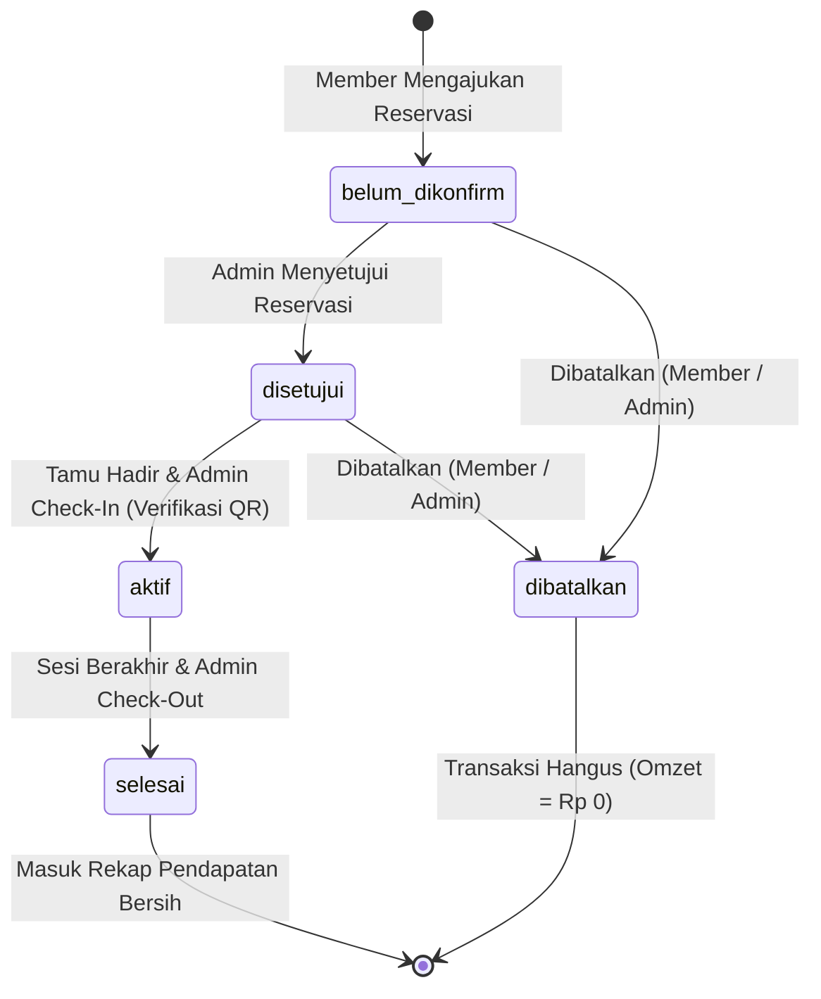
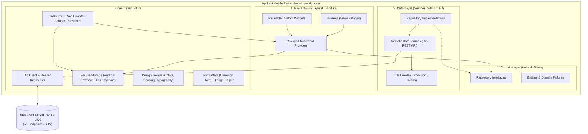
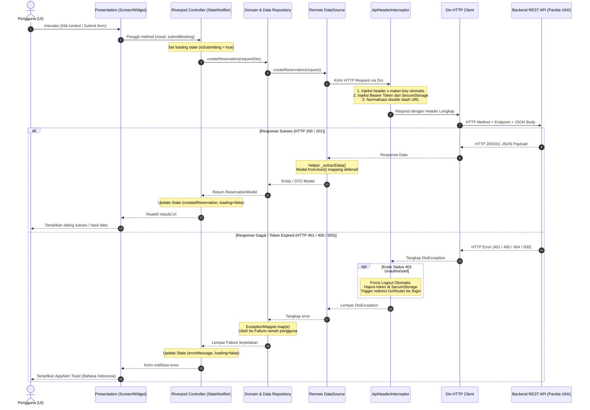

<div align="center">

# 🏢 Smart Space Booking
### Modern Coworking Space & Workstation Reservation Mobile Application
**Solusi Digital Terpadu Reservasi Ruang Kerja & Manajemen Coworking Multi-Tenant Lintas Peran**

[](https://flutter.dev)
[](https://dart.dev)
[](https://riverpod.dev)
[](https://pub.dev/packages/go_router)
[]()
[-red?style=for-the-badge&logo=android)]()
[-brightgreen?style=for-the-badge&logo=postman&logoColor=white)]()
[-success?style=for-the-badge&logo=checkmarx&logoColor=white)]()

<br>

<p align="center">
  <b>Uji Kompetensi Keahlian (UKK) Rekayasa Perangkat Lunak 2026/2027</b><br>
  <b>SMK Telkom Malang — Paket B: Smart Coworking Space Booking (Lampiran D)</b>
</p>

[Latar Belakang](#-latar-belakang--problem-statement) •
[Fitur Berdasarkan Peran](#-fitur-lengkap-berdasarkan-peran) •
[Siklus Status Reservasi](#-siklus-status-reservasi-state-machine) •
[Arsitektur & Direktori](#-arsitektur-perangkat-lunak--struktur-proyek) •
[Keputusan Rekayasa Penting](#-sorotan-rekayasa-teknis-engineering-highlights) •
[Alur Pemanggilan API (Call Flow)](#-arsitektur--alur-pemanggilan-api-api-call-flow) •
[Matriks Kontrak API (50 Endpoint)](#-matriks-kontrak-api-50-endpoint-lengkap) •
[Sistem Desain UI/UX](#-sistem-desain--pengalaman-pengguna-uiux) •
[Instalasi & Menjalankan](#-panduan-instalasi--menjalankan-proyek) •
[Panduan Penguji (Cheatsheet UKK)](#-panduan-pengujian-cepat-untuk-penguji-cheatsheet-ukk) •
[Jaminan Kualitas (QA)](#-jaminan-kualitas--pengujian-otomatis-qa)

---

</div>

## 📖 Latar Belakang & Problem Statement

Pengelolaan operasional reservasi coworking space dan workstation secara konvensional (melalui pesan instan, buku tamu fisik, atau spreadsheet) memiliki 3 celah fatal:
1. **Bentrok Jadwal (*Double Booking*)**: Tidak adanya validasi ketersediaan slot meja/ruangan secara *real-time*, sehingga dua pelanggan dapat memesan ruangan yang sama pada rentang jam yang bertabrakan.
2. **Ketiadaan Bukti Sah yang Terverifikasi**: Tamu kesulitan membuktikan keabsahan reservasinya di meja resepsionis tanpa sistem tiket digital resmi berbasis QR Code unik.
3. **Pencatatan Finansial Manual**: Pengelola kesulitan menghitung estimasi pendapatan kotor, akumulasi potongan voucher diskon, dan realisasi pendapatan bersih per jenis ruangan secara akurat dan otomatis.

### Solusi yang Dihadirkan: Smart Space Booking
**Smart Space Booking** adalah aplikasi mobile *native-grade* berbasis **Flutter** dengan arsitektur **Clean Architecture (Feature-First)** yang mengintegrasikan dua peran pengguna (**Member** dan **Admin Pengelola Space**) ke dalam satu ekosistem terpadu:
* 🛡️ **Pencegahan Double-Booking**: Mesin pengecekan ketersediaan slot waktu dinamis (`/api/spaces/availability`) dengan *double-check validation* sesaat sebelum transaksi dikirim ke server.
* 🎫 **E-Ticket Digital QR Code**: Penerbitan tiket instan dengan barcode 2D QR Code yang dapat langsung diverifikasi oleh resepsionis di lokasi saat tamu *check-in*.
* 📊 **Laporan Finansial Bulanan**: Rekapitulasi pendapatan otomatis (omzet kotor, total diskon, omzet bersih, akumulasi jam pakai) lengkap dengan visualisasi proporsi pendapatan per tipe ruangan.
* 🌐 **Multi-Tenant Ready**: Mendukung isolasi data tenant antar peserta ujian menggunakan header wajib `x-maker-key` dan konfigurasi dinamis langsung dari antarmuka aplikasi tanpa kompilasi ulang.
* 🎨 **Visual Canvas Native**: Ilustrasi onboarding interaktif dan garis perforasi tiket dibuat murni di atas Canvas Flutter (`CustomPainter`), menghasilkan grafis tajam tanpa beban aset gambar eksternal.

---

## ✨ Fitur Lengkap Berdasarkan Peran

Aplikasi mengimplementasikan **seluruh 24 Kebutuhan Fungsional (FR-01 s.d. FR-24)** dari PRD dan spesifikasi soal UKK Paket B:

```
┌─────────────────────────────────────────────────────────────────────────────────┐
│                           SMART SPACE BOOKING SYSTEM                            │
├──────────────────────────────────────┬──────────────────────────────────────────┤
│        👤 MODUL MEMBER (TAMU)        │       🛡️ MODUL ADMIN (PENGELOLA)        │
├──────────────────────────────────────┼──────────────────────────────────────────┤
│ • Onboarding Interaktif (3 Slide)    │ • Registrasi Lokasi Coworking & Admin    │
│ • Registrasi Akun & Foto Profil      │ • Dashboard Operasional & Real-time KPI  │
│ • Login Aman dengan Sesi Terenkripsi │ • Master Data Member (CRUD Penuh)        │
│ • Katalog Space (Desk/Meeting/Office)│ • Master Data Space & Upload Foto Ruangan│
│ • Filter Tipe Ruangan & Quick Search │ • Master Data Diskon/Promo (CRUD Penuh)  │
│ • Cek Ketersediaan Real-Time         │ • Operasional Check-In Tamu              │
│ • Klaim Kupon Diskon / Voucher Promo │ • Operasional Check-Out (Dialog Aman)    │
│ • Rincian Biaya Transparan           │ • Filter Multi-Parameter Reservasi Masuk │
│ • E-Ticket Resmi Berfitur QR Code    │ • Laporan Finansial Bulanan Komprehensif │
│ • Pelacakan Status Pemesanan 5 Fase  │ • Distribusi Pendapatan per Tipe Space   │
│ • Histori Transaksi & Filter Bulanan │ • Profil Lokasi & Informasi Kontak Space │
│ • Profil & Rekap Pengeluaran Pribadi │ • Pengaturan Jaringan & Server Switcher  │
└──────────────────────────────────────┴──────────────────────────────────────────┘
```

### 1. 👤 Modul Member (Penyewa / Tamu)
* **Onboarding & Autentikasi**:
  * Pengenalan fitur lewat 3 layar onboarding beranimasi halus: *Discover Workspaces*, *Instant Real-Time Booking*, dan *Smart QR Check-In*.
  * Pendaftaran akun member baru (`/api/auth/register/member`) lengkap dengan nama, instansi, nomor telepon, alamat, username, dan unggah foto profil (`multipart/form-data`).
  * Login kredensial aman dengan penyimpanan token JWT terenkripsi dan fitur auto-login otomatis.
* **Katalog & Eksplorasi Ruangan**:
  * Menampilkan seluruh inventaris ruangan dengan foto resolusi tinggi, kapasitas orang, tarif sewa per jam, dan badge fasilitas (WiFi, AC, Proyektor, Kopi, Whiteboard, dll.).
  * Filter instan berbasis kategori (*Personal Desk*, *Meeting Room*, *Private Office*) serta kolom pencarian nama ruangan yang responsif.
* **Mesin Pemesanan & Slot Availability Engine**:
  * Pemilihan tanggal sewa (hari lampau dinonaktifkan, maksimal 90 hari ke depan), jam mulai, dan durasi penggunaan.
  * Tombol **Cek Ketersediaan** yang mengecek bentrok slot ke server secara *real-time* sebelum pemesanan diajukan.
  * Pengecekan ulang otomatis (*pre-submit double check*) untuk menjamin tidak terjadi *race condition* antar pengguna.
* **Kalkulasi Biaya & Kupon Diskon**:
  * Validasi kode kupon promo (`/api/diskon/check`) dengan verifikasi rentang masa berlaku.
  * Ringkasan rincian biaya transparan: Subtotal (Durasi × Tarif per Jam), Potongan Diskon, dan Total Bayar Bersih (dijaga minimal Rp 0).
* **Pelacakan Status & Pembatalan Mandiri**:
  * Layar pelacakan status dengan tab filter (Semua, Menunggu, Disetujui, Aktif, Selesai, Dibatalkan).
  * Fitur pembatalan mandiri untuk pemesanan yang masih berstatus `belum_dikonfirm` atau `disetujui`.
* **Tiket Digital (E-Ticket) dengan QR Code**:
  * Menampilkan e-ticket resmi bergaya boarding pass modern dengan nomor reservasi, detail space, jadwal sewa, nama pemesan, dan QR Code dinamis (`qr_flutter`) untuk proses *check-in* di resepsionis.
* **Histori Pemesanan Bulanan**:
  * Arsip riwayat pemesanan yang dapat difilter per bulan dan tahun.
  * Kartu ringkasan finansial personal: Total Reservasi, Akumulasi Jam, dan Total Pengeluaran bulanan.
* **Profil & Akun Member**:
  * Tampilan kartu identitas digital member, informasi instansi, nomor kontak, statistik pemakaian personal (`.fold()` akumulasi), dan tombol logout aman.

### 2. 🛡️ Modul Admin (Pengelola Coworking Space)
* **Registrasi & Dashboard Lokasi**:
  * Registrasi lokasi coworking dan akun pemilik baru (`/api/auth/register/admin-space`).
  * Dashboard harian dengan kartu metrik ringkasan: Reservasi Hari Ini, Menunggu Konfirmasi, Tamu Aktif di Lokasi, Transaksi Selesai, dan Estimasi Omzet.
* **Master Data Member (CRUD Penuh)**:
  * Tambah member baru langsung dari portal admin dengan form validasi lengkap.
  * Cari member berdasarkan nama/instansi, perbarui data profil/kontak, dan hapus akun member.
* **Master Data Ruangan & Upload Media Multipart**:
  * Tambah ruangan baru (*Personal Desk*, *Meeting Room*, *Private Office*).
  * Kelola tarif per jam, kapasitas kursi, dan daftar fasilitas pendukung.
  * Upload foto ruangan asli via endpoint multipart (`/api/upload/spaces`) dengan integrasi kamera dan galeri (`image_picker`).
  * Edit dan hapus data ruangan dari inventaris.
* **Master Data Kupon Diskon / Promo (CRUD Penuh)**:
  * Buat kode kupon promo baru dengan persentase diskon (1% s.d. 100%).
  * Atur tanggal mulai dan tanggal berakhir masa berlaku promo.
  * Indikator status promo aktif atau kedaluwarsa secara otomatis.
* **Operasional Resepsionis (Check-In & Check-Out)**:
  * Filter daftar reservasi masuk berdasarkan status, nama space, maupun tanggal spesifik.
  * Konfirmasi pesanan baru (`belum_dikonfirm` → `disetujui`) atau tolak pesanan (`dibatalkan`).
  * Aksi **Check-In** satu ketuk saat tamu tiba dan menunjukkan e-ticket QR Code (`disetujui` → `aktif`).
  * Aksi **Check-Out** saat sesi sewa berakhir (`aktif` → `selesai`) yang dilindungi oleh **dialog konfirmasi dua langkah** untuk mencegah ketidaksengajaan petugas.
* **Laporan Finansial Bulanan & Distribusi Omzet**:
  * Pemilih bulan dan tahun fleksibel untuk audit pembukuan.
  * 5 Metrik Finansial Utama:
    1. **Estimasi Pendapatan Kotor**
    2. **Total Potongan Diskon**
    3. **Realisasi Pendapatan Bersih**
    4. **Total Transaksi Reservasi**
    5. **Akumulasi Durasi Jam Terpakai**
  * Visualisasi bar proporsional distribusi pendapatan per kategori ruangan (*Personal Desk*, *Meeting Room*, *Private Office*).
* **Profil Coworking Space**:
  * Tinjau dan perbarui nama lokasi coworking, nama penanggung jawab/pemilik, nomor telepon, dan alamat operasional.

### 3. ⚙️ Fitur Penguji & Developer (Developer Excellence)
* **Dynamic Server & Maker Key Switcher (`ServerConfigBottomSheet`)**:
  * Tombol pintas konfigurasi jaringan di pojok kanan atas layar login (`Icons.settings_ethernet`).
  * Penguji dapat mengganti **Base URL** dan **`x-maker-key`** secara dinamis saat aplikasi berjalan tanpa perlu mengompilasi ulang kode sumber.
  * **Tombol Preset 1-Ketuk**:
    * 🏫 *Server Sekolah / Production*: `https://learn.smktelkom-mlg.sch.id/coworking`
    * 📱 *Android Emulator*: `http://10.0.2.2:3000`
    * 💻 *Localhost / Desktop*: `http://localhost:3000`
  * Tombol **Uji Koneksi** (`GET /health`) dengan indikator latensi real-time untuk memastikan server dapat dijangkau sebelum login.

---

## 🔄 Siklus Status Reservasi (State Machine)

Alur status reservasi dirancang dengan aturan transisi status yang ketat sesuai spesifikasi UKK:



### Matriks Aturan Transisi Status & Hak Akses

| Status Sistem | Label Tampilan UI | Aksen Warna | Hak Akses Member | Hak Akses Admin |
|:---:|:---:|:---:|:---:|:---:|
| `belum_dikonfirm` | **Menunggu** | 🟡 Amber (`#D97706`) | Dapat melihat rincian & membatalkan | Dapat **Menyetujui** atau **Menolak** |
| `disetujui` | **Disetujui** | 🔵 Biru Info (`#2563EB`) | **E-Ticket QR Aktif**, dapat membatalkan | Dapat melakukan **Check-In Tamu** |
| `aktif` | **Sedang Digunakan** | 🟢 Hijau Emerald (`#059669`) | Menampilkan sesi aktif & waktu mulai | Dapat melakukan **Check-Out Tamu** |
| `selesai` | **Selesai** | ⚪ Slate Gray (`#64748B`) | Tersimpan di Histori Transaksi | Tercatat di Laporan Finansial Bulanan |
| `dibatalkan` | **Dibatalkan** | 🔴 Merah Crimson (`#DC2626`) | Status arsip batal | Tidak dihitung dalam pendapatan bersih |

---

## 🏗️ Arsitektur Perangkat Lunak & Struktur Proyek

Aplikasi dibangun mengikuti standar industri **Clean Architecture** dengan pendekatan **Feature-First (Modular by Feature)**. Pola ini memastikan pemisahan tanggung jawab (*separation of concerns*), independensi logika bisnis, kemudahan pengujian otomatis, serta keteraturan kode:



### Struktur Direktori Lengkap (`lib/`)

```
lib/
├── main.dart                                  # Titik masuk utama (ProviderScope + MaterialApp.router)
│
├── core/                                      # Fondasi Global & Utilitas Lintas Fitur
│   ├── errors/
│   │   ├── failure.dart                       # Domain Failure abstractions (ServerFailure, NetworkFailure, dll.)
│   │   └── exception_mapper.dart              # Pemetaan DioException & HTTP Status -> Pesan ramah pengguna
│   ├── network/
│   │   ├── api_endpoints.dart                 # Sumber kebenaran URL path 50 endpoint API
│   │   ├── api_header_interceptor.dart        # Interceptor otomatis (x-maker-key, Bearer Token, 401 Expiry)
│   │   └── dio_client.dart                    # Konfigurasi instance Dio HTTP Client dengan timeout 15s
│   ├── router/
│   │   └── app_router.dart                    # GoRouter dengan proteksi rute berbasis Role (Member vs Admin)
│   ├── storage/
│   │   └── secure_storage_service.dart        # Enkripsi sesi lokal via Android Keystore & RAM Cache
│   ├── theme/
│   │   ├── app_colors.dart                    # Token warna terstandarisasi (Terracotta, Teal, Amber, Slate)
│   │   ├── app_spacing.dart                   # Grid spasi konsisten (xs: 4dp, sm: 8dp, md: 12dp, lg: 16dp, xl: 24dp)
│   │   ├── app_typography.dart                # Tipografi Sora (Headings) & Inter (Body/Data Finansial)
│   │   └── app_theme.dart                     # Konfigurasi ThemeData Material 3
│   ├── utils/
│   │   ├── app_url_helper.dart                # Resolusi URL foto & normalisasi port backend otomatis
│   │   ├── currency_formatter.dart            # Pemformatan mata uang Rupiah dengan manual fallback modulo 3
│   │   ├── date_formatter.dart                # Pemformatan tanggal Indonesia & standarisasi format API
│   │   └── image_picker_helper.dart           # Pembungkus helper ImagePicker (Kamera & Galeri)
│   └── widgets/
│       ├── app_alert.dart                     # Banner notifikasi & toast kustom bergaya modern
│       ├── app_illustrations.dart             # Ilustrasi vektor kustom untuk state kosong/login
│       ├── app_photo_picker_field.dart        # Komponen interaktif pemilihan foto profil & space
│       ├── app_shimmer.dart                   # Komponen skeleton loading shimmer anti-blank
│       ├── auth_illustration.dart             # Ilustrasi adaptif role Member/Admin
│       ├── server_config_bottom_sheet.dart    # Modal dialog pengaturan dinamis Base URL & Maker Key
│       └── status_badge.dart                  # Badge status reservasi seragam di seluruh layar
│
└── features/                                  # Fitur Bisnis (Feature-First Architecture)
    ├── onboarding/                            # Modul Onboarding Interaktif
    │   └── presentation/
    │       ├── screens/
    │       │   ├── splash_screen.dart         # Layar splash pembuka dengan inisialisasi sesi
    │       │   ├── onboarding_screen.dart     # Komponen geser per halaman onboarding
    │       │   └── onboarding_flow_screen.dart# Alur 3 layar onboarding dengan smooth page indicator
    │       └── widgets/
    │           └── onboarding_illustrations.dart # 3 Ilustrasi Canvas Native (Discover, Booking, QR Check-In)
    │
    ├── auth/                                  # Modul Autentikasi & Registrasi
    │   ├── data/
    │   │   ├── datasources/auth_remote_datasource.dart
    │   │   └── models/auth_models.dart        # UserModel, UserSession, DTO Requests
    │   ├── domain/
    │   │   └── repositories/auth_repository.dart
    │   └── presentation/
    │       ├── providers/auth_controller.dart # State sesi user, AsyncValue.guard, auto-login
    │       └── screens/
    │           ├── login_screen.dart          # Layar login dwifungsi (Member & Admin)
    │           ├── register_member_screen.dart# Formulir registrasi tamu/member (dengan upload foto)
    │           └── register_admin_screen.dart # Formulir registrasi pengelola lokasi coworking
    │
    ├── spaces/                                # Modul Katalog & Reservasi Ruangan
    │   ├── data/
    │   │   ├── datasources/spaces_remote_datasource.dart
    │   │   └── models/space_models.dart       # SpaceModel, AvailabilityResult, PromoCheckResult
    │   ├── domain/
    │   │   └── repositories/spaces_repository.dart
    │   └── presentation/
    │       ├── providers/spaces_controller.dart # Cache 5 menit, kalkulasi biaya sewa, form state
    │       └── screens/
    │           ├── spaces_catalog_screen.dart # Katalog ruang kerja dengan filter & pencarian instan
    │           └── space_detail_booking_screen.dart # Detail space, form booking, ketersediaan, promo
    │
    ├── reservations/                          # Modul Siklus Reservasi, Tiket & Histori
    │   ├── data/
    │   │   └── datasources/reservations_remote_datasource.dart
    │   ├── domain/
    │   │   └── repositories/reservations_repository.dart
    │   └── presentation/
    │       ├── providers/reservations_controller.dart # Defensive data enrichment, fold() statistik
    │       └── screens/
    │           ├── reservations_status_screen.dart  # Layar status reservasi aktif dengan tab filter
    │           ├── e_ticket_screen.dart             # Layar e-ticket resmi dengan QR Code & garis putus-putus
    │           └── reservations_history_screen.dart # Histori reservasi dengan filter bulan & rekap
    │
    ├── member/                                # Modul Shell & Profil Pengunjung
    │   └── presentation/screens/
    │       ├── member_shell_screen.dart       # Navigasi utama member (4 Tab BottomNavigationBar)
    │       └── member_profile_screen.dart     # Profil member & ringkasan statistik pemakaian
    │
    └── admin/                                 # Modul Panel Pengelola Coworking
        ├── data/
        │   ├── datasources/admin_remote_datasource.dart
        │   └── models/admin_models.dart       # AdminProfile, AdminMember, AdminSpace, MonthlyReport
        ├── domain/
        │   └── repositories/admin_repository.dart
        ├── presentation/
        │   ├── providers/admin_controller.dart # CRUD state management, search query, multipart
        │   ├── widgets/
        │   │   ├── admin_stat_card.dart       # Kartu statistik metrik dashboard admin
        │   │   └── confirmation_dialog.dart   # Dialog konfirmasi aksi destruktif dua langkah
        │   └── screens/
        │       ├── admin_shell_screen.dart    # Navigasi utama admin (4 Tab BottomNavigationBar)
        │       ├── admin_dashboard_screen.dart# Dashboard ringkasan operasional harian
        │       ├── admin_reservations_screen.dart # Manajemen reservasi masuk & filter multi-parameter
        │       ├── admin_reservation_detail_screen.dart # Detail reservasi, aksi konfirmasi/check-in/check-out
        │       ├── admin_master_data_screen.dart # Hub Master Data (Space, Member, Diskon)
        │       ├── admin_spaces_screen.dart   # CRUD Ruangan & upload foto via kamera/galeri
        │       ├── admin_members_screen.dart  # CRUD Member pengguna
        │       ├── admin_discounts_screen.dart# CRUD Kupon diskon/promo
        │       ├── admin_monthly_report_screen.dart # Rekapitulasi pendapatan & distribusi omzet
        │       └── admin_profile_screen.dart  # Profil lokasi & pengaturan coworking
```

---

## 💡 Sorotan Rekayasa Teknis (Engineering Highlights)

Berikut adalah beberapa implementasi algoritma dan keputusan arsitektural penting yang diterapkan pada aplikasi:

### 1. Jembatan Riverpod ke GoRouter (`_ListenableAuth`)
GoRouter membutuhkan turunan `ChangeNotifier` agar mengetahui kapan harus mengevaluasi ulang fungsi pengalihan rute (`redirect`). Kami membuat class `_ListenableAuth` yang mendengarkan `authControllerProvider` dan `onboardingCompleteProvider`. Menggunakan `WidgetsBinding.instance.addPostFrameCallback`, notifikasi dikirimkan tepat setelah frame selesai digambar, mencegah potensi error *setState during build*.

### 2. Transisi Halaman Kustom Mulus (`_buildSmoothPage`)
Alih-alih transisi default platform yang kaku, aplikasi menerapkan `CustomTransitionPage` berdurasi 260ms dengan kurva `Curves.easeOutCubic`. Transisi ini memadukan geseran tipis horizontal (micro-slide 6%) dan efek fading halus untuk menghadirkan nuansa aplikasi modern kelas enterprise.

### 3. Trik Retensi Cache Memori 5 Menit
Pada `spacesListProvider`, kami memadukan fitur `autoDispose` Riverpod dengan `ref.keepAlive()` dan `Timer(Duration(minutes: 5))`. Hasilnya: saat pengguna bolak-balik berpindah tab navigasi, data katalog tidak perlu memuat ulang dari internet (muncul instan), namun memori tetap otomatis dibersihkan jika tab ditinggalkan lebih dari 5 menit.

### 4. Pencegahan Bentrok Jadwal (*Race Condition Pre-Submit Check*)
Pada method `submitBooking` di `BookingController`, sistem tidak hanya mengandalkan hasil pengecekan slot di awal formulir. Tepat sebelum data pesanan dikirim ke endpoint `POST /api/reservasi`, controller melakukan verifikasi ketersediaan ulang secara instan (*double-check validation*). Jika ada pemesan lain yang baru saja membayar slot tersebut pada detik yang sama, pemesanan dicegah secara aman.

### 5. *Defensive Data Enrichment* pada Riwayat Reservasi
Terkadang respons backend UKK untuk daftar reservasi hanya menyertakan data minimal dengan nilai `totalBayar <= 0` atau nama/foto ruangan `null`. Controller secara defensif mengambil data katalog ruangan dan mencocokkannya (*mapping*) berdasarkan `spaceId` atau nama ruangan di sisi klien. Nilai subtotal, diskon, foto, dan total bayar otomatis dilengkapi sehingga tampilan kartu tiket tidak pernah kosong.

### 6. Algoritma Manual Formatter Rupiah (*Fallback Modulo 3*)
Jika package `intl` atau locale `id_ID` belum siap pada perangkat Android versi lama, class `CurrencyFormatter` memiliki algoritma manual berbasis perulangan karakter:
$$\text{rev} = \text{panjang string} - i$$
Setiap kali nilai $\text{rev} > 1$ dan $\text{rev} \pmod 3 = 1$, tanda titik (.) disisipkan sebagai pemisah ribuan.

### 7. Gambar Vektor Native Canvas (`CustomPainter`)
Ilustrasi pada alur onboarding serta garis putus-putus perforasi sobekan tiket digambar secara native menggunakan `CustomPainter`. Pendekatan ini mengeliminasi ketergantungan pada file gambar bitmap/SVG eksternal, membuat ukuran APK sangat ramping, dan menghasilkan tampilan grafis yang selalu tajam pada resolusi layar apa pun.

---

## 🔄 Arsitektur & Alur Pemanggilan API (API Call Flow)

Seluruh komunikasi data antara aplikasi Flutter dan server REST API diatur melalui arsitektur berlapis yang konsisten, terisolasi, dan aman. Tidak ada layar (*Screen*) yang memanggil `Dio` secara langsung. Setiap request wajib melewati lapisan abstraksi: **Presentation (Screen & Controller) ➔ Domain (Repository Interface) ➔ Data (Repository Impl & Remote DataSource) ➔ Core Network (Dio Client & Interceptor)**.

### 1. Diagram Siklus Pemanggilan API Berlapis (Layered Request-Response Lifecycle)



---

### 2. Alur Rinci 6 Skenario Utama Pemanggilan API (End-to-End User Journey)

#### 🔐 Skenario 1: Autentikasi & Penyimpanan Sesi Terenkripsi (Login Flow)
1. **Input Kredensial**: Pengguna memilih peran (**Member** atau **Admin Coworking**), menginput username dan password di `LoginScreen`.
2. **Pemicu Controller**: Form memanggil `ref.read(authControllerProvider.notifier).login(username, password, role)`.
3. **Penyisipan Kunci Tenant**: `ApiHeaderInterceptor` otomatis menyisipkan header multi-tenant `x-maker-key: <app_key>` dari konfigurasi aktif.
4. **Panggilan Endpoint**: Mengirim `POST /api/auth/login` dengan request body `{ "username": "...", "password": "..." }`.
5. **Penyimpanan Terenkripsi Hardware**: Server mengembalikan JWT `access_token` beserta objek profil pengguna. Token disimpan ke `SecureStorageService` yang terenkripsi hardware via **Android Keystore (AES-GCM)** serta di-cache ke memori RAM untuk akses instan tanpa jeda baca disk.
6. **Pengalihan Rute Otomatis**: Pembaruan status sesi di `authControllerProvider` otomatis memicu `_ListenableAuth`, dan `GoRouter` mengarahkan layar ke beranda sesuai peran pengguna (`/member` atau `/admin`).

#### 🏢 Skenario 2: Eksplorasi Katalog Ruangan & Caching Memori 5 Menit (Catalog Flow)
1. **Pemicu Provider**: Saat `SpacesCatalogScreen` dibuka, `spacesListProvider` diinisialisasi dengan konfigurasi `ref.keepAlive()` dan `Timer(Duration(minutes: 5))`.
2. **Panggilan Endpoint**: `SpacesRemoteDataSourceImpl` memanggil `GET /api/spaces?tipe=<tipe>&search=<keyword>`.
3. **Ekstraksi Data Defensif**: Metode `_extractData` mengekstrak data dari berbagai kemungkinan format respons server (baik array langsung, objek dengan bungkus `data`, atau string JSON).
4. **Fallback Filter Sisi Klien**: Jika backend ujian mengabaikan query parameter, aplikasi secara cerdas memfilter kecocokan tipe (*Personal Desk*, *Meeting Room*, *Private Office*) dan keyword pencarian di memori lokal.
5. **Retensi Cache**: Jika pengguna berpindah-pindah tab navigasi dalam kurun 5 menit, katalog tampil instan dari RAM tanpa request jaringan ulang.

#### ⏱️ Skenario 3: Pengecekan Ketersediaan Slot & Tabrakan Jam (Availability Engine & Collision Check)
1. **Input Parameter Sewa**: Pengguna memilih tanggal, jam mulai sewa (misal `09:00`), dan durasi (misal `3 Jam` $\implies$ rentang `09:00 - 12:00`).
2. **Validasi Waktu Lokal (Anti Jam Lampau)**:
   - Jika tanggal sewa adalah hari ini, sistem membandingkan jam mulai terhadap jam perangkat saat ini:
   $$\text{Jam Perangkat} > \text{Jam Mulai} \implies \text{Ditolak ("Jam sewa sudah terlewat")}$$
3. **Cross-Check Database Reservasi (Pencegahan Double-Booking)**:
   - Sistem memeriksa daftar reservasi aktif pada tanggal & space yang sama dari endpoint `/api/admin/reservasi` atau `/api/reservasi/my`.
   - Algoritma `TimeSlotCollisionHelper.isRangeColliding` mengonversi waktu ke menit sejak tengah malam:
   $$\text{Bentrok} = (T_{\text{mulai}} < R_{\text{selesai}}) \land (T_{\text{selesai}} > R_{\text{mulai}})$$
   - Jika terjadi irisan/overlap, langsung mengembalikan status `isAvailable = false` dengan informasi: *"Slot ruangan pukul 09:00 - 12:00 sudah ter-reservasi (#BK-XXXXXX)"*.
4. **Panggilan Endpoint Server**: Mengirim `GET /api/spaces/availability?id_space=X&tanggal=Y&jam_mulai=Z&durasi_jam=N`.
5. **Proteksi Tombol "Lanjutkan Reservasi" (*Auto Pre-Check*)**:
   - Saat pengguna menekan tombol "Lanjutkan Reservasi", sistem **otomatis menjalankan pengecekan terlebih dahulu**.
   - Jika slot terisi, sistem memblokir form konfirmasi, menampilkan kartu peringatan merah, dan memunculkan pop-up bahaya (*toast danger*).

#### 📝 Skenario 4: Pembuatan Transaksi Reservasi (Booking Creation Flow)
1. **Validasi Kupon Diskon (Opsional)**: Pengguna mengetik kode promo $\implies$ aplikasi memanggil `POST /api/diskon/check` dengan payload `{ nama_diskon }`. Persentase diskon diparsing dan memotong subtotal secara otomatis.
2. **Pengecekan Ganda Sebelum Submit (*Anti-Race Condition*)**: Tepat sebelum data pesanan dikirim, controller mengecek ketersediaan slot sekali lagi untuk mengantisipasi jika ada pemesan lain yang baru saja membayar slot tersebut pada detik yang sama.
3. **Panggilan Endpoint Transaksi**: Mengirim `POST /api/reservasi` dengan body lengkap:
   ```json
   {
     "id_space": 1,
     "tanggal_reservasi": "2026-09-15",
     "jam_mulai": "09:00",
     "durasi_jam": 3,
     "id_diskon": 2,
     "harga_per_jam": 50000,
     "subtotal": 150000,
     "potongan_diskon": 30000,
     "total_bayar": 120000
   }
   ```
4. **Parsing Respons & Fallback Kode Booking**: Server mengembalikan `ReservationModel`. Jika kode booking kosong dari server, sistem otomatis membuat kode unik rapi `BK-XXXXXX`.
5. **Modal Dialog Sukses Modern**: Menampilkan modal dialog sukses beranimasi glow checkmark, tiket kode booking monospace dengan tombol salin (clipboard), rincian pesanan, dan dual tombol navigasi ke E-Ticket.

#### 🎫 Skenario 5: Siklus Hidup E-Ticket & Penguncian QR Code (E-Ticket Lifecycle Flow)
1. **Panggilan Endpoint Tiket**: Mengirim `GET /api/reservasi/:id/e-ticket`.
2. **Ekstraksi Tiket Digital**: Mengambil data jadwal, ruangan, profil pemesan, rincian pembayaran, dan string payload QR Code.
3. **Logika Pengaman Status (*QR Code Lock Logic*)**:
   - Jika status pemesanan masih `belum_dikonfirm` / `menunggu`: **QR Code disembunyikan dan dikunci**, digantikan kartu placeholder informasi dengan ikon gembok waktu (`Icons.lock_clock_rounded`). Ini mencegah tamu melakukan check-in tanpa persetujuan admin.
   - Jika status pemesanan sudah `disetujui`: **QR Code aktif dan dirender secara dinamis** menggunakan widget `qr_flutter` siap untuk dipindai resepsionis.

#### 🛡️ Skenario 6: Operasional Resepsionis Admin (Konfirmasi, Check-In & Check-Out)
1. **Persetujuan Pesanan**: Admin meninjau pesanan masuk di `AdminReservationsScreen`. Memanggil `PATCH /api/admin/reservasi/:id/status` dengan body `{ "status": "disetujui" }`.
2. **Proses Check-In Tamu**: Saat tamu tiba di lokasi dan menunjukkan E-Ticket QR Code, admin menekan tombol **Check-In**. Aplikasi memanggil `POST /api/admin/reservasi/:id/check-in`, status pemesanan berubah menjadi `aktif`.
3. **Proses Check-Out Terproteksi**: Saat sesi sewa berakhir, admin menekan tombol **Check-Out**. Dialog konfirmasi dua langkah muncul untuk mencegah klik tak sengaja. Setelah dikonfirmasi, aplikasi memanggil `POST /api/admin/reservasi/:id/check-out`, status berubah menjadi `selesai` dan otomatis masuk ke rekapitulasi pendapatan bersih.

---

### 3. Komponen Infrastruktur Jaringan (Network Infrastructure)

| Komponen | File Sumber | Peran & Tanggung Jawab Utama |
|---|---|---|
| **Dio Client** | [`dio_client.dart`](lib/core/network/dio_client.dart) | Mengonfigurasi instance singleton HTTP Client dengan batasan `connectTimeout: 15s`, `receiveTimeout: 15s`, dan `LogInterceptor` otomatis nonaktif di mode release. |
| **Header Interceptor** | [`api_header_interceptor.dart`](lib/core/network/api_header_interceptor.dart) | Menyisipkan header wajib `x-maker-key` dan `Authorization: Bearer <token>`, menormalisasi URL dari *double slash* (`//`), serta mengeksekusi force logout saat server merespons kode `401 Unauthorized`. |
| **API Endpoints** | [`api_endpoints.dart`](lib/core/network/api_endpoints.dart) | Pusat konstanta URL 50 endpoint API dengan variabel dinamis `baseUrl` yang dapat diganti langsung dari antarmuka aplikasi. |
| **Exception Mapper** | [`exception_mapper.dart`](lib/core/errors/exception_mapper.dart) | Menerjemahkan setiap jenis error teknis Dio (Timeout, 400 Bad Request, 401 Unauthorized, 403 Forbidden, 404 Not Found, 500 Server Error) ke dalam pesan Bahasa Indonesia yang ramah bagi pengguna. |
| **Network Image Helper** | [`app_url_helper.dart`](lib/core/utils/app_url_helper.dart) | Menormalisasi URL foto dari server, mengganti host `localhost:3000` menjadi domain aktif, dan menangani fallback placeholder jika gambar tidak ditemukan. |

---

## 📡 Matriks Kontrak API (50 Endpoint Lengkap)

Aplikasi telah diaudit secara ketat dan **100% patuh** terhadap seluruh 50 endpoint yang didefinisikan pada Postman Collection UKK Paket B:

<details open>
<summary><b>Klik untuk Membuka Matriks Lengkap 50 Endpoint API</b></summary>
<br>

| No | Modul / Folder | Method | URL Endpoint | Fungsi & Implementasi di Aplikasi |
|:---:|---|:---:|---|---|
| **1** | `0. Root & Health` | `GET` | `/` | Cek status server API panitia |
| **2** | `0. Root & Health` | `GET` | `/health` | Health check & pengujian latensi koneksi di `ServerConfigBottomSheet` |
| **3** | `1. App Maker` | `POST` | `/api/maker/register` | Pendaftaran App Maker tenant (penyedia `app_key`) |
| **4** | `1. App Maker` | `POST` | `/api/maker/login` | Login akun developer App Maker |
| **5** | `1. App Maker` | `GET` | `/api/maker/me` | Mengambil data identitas & `app_key` siswa aktif |
| **6** | `1. App Maker` | `GET` | `/api/maker/stats` | Ringkasan statistik data tenant App Maker |
| **7** | `1. App Maker` | `GET` | `/api/maker/list` | Daftar publik seluruh App Maker terdaftar |
| **8** | `2. Autentikasi` | `POST` | `/api/auth/register/member` | Registrasi akun Member / Tamu baru |
| **9** | `2. Autentikasi` | `POST` | `/api/auth/register/admin-space` | Registrasi pengelola coworking & admin baru |
| **10** | `2. Autentikasi` | `POST` | `/api/auth/login` | Login user (Member/Admin) & penerbitan Bearer Token |
| **11** | `2. Autentikasi` | `GET` | `/api/auth/profile` | Mengambil profil user yang sedang login |
| **12** | `3. Space Coworking` | `GET` | `/api/spaces/types` | Mengambil daftar kategori/tipe ruangan yang ada |
| **13** | `3. Space Coworking` | `GET` | `/api/spaces/availability` | Validasi slot ketersediaan ruangan sebelum pemesanan |
| **14** | `3. Space Coworking` | `GET` | `/api/spaces` | Katalog space dengan parameter pencarian dan filter tipe |
| **15** | `3. Space Coworking` | `GET` | `/api/spaces/:id` | Mengambil detail spesifik ruangan & fasilitas |
| **16** | `4. Diskon & Promo` | `GET` | `/api/diskon/active` | Mengambil daftar kupon diskon yang sedang aktif |
| **17** | `4. Diskon & Promo` | `POST` | `/api/diskon/check` | Validasi kode voucher & kalkulasi persentase diskon |
| **18** | `4. Diskon & Promo` | `GET` | `/api/diskon/:id` | Detail data kupon promo tertentu |
| **19** | `5. Reservasi Member` | `POST` | `/api/reservasi` | Pengajuan pembuatan reservasi sewa ruangan |
| **20** | `5. Reservasi Member` | `GET` | `/api/reservasi/my` | Daftar seluruh pemesanan milik member aktif |
| **21** | `5. Reservasi Member` | `GET` | `/api/reservasi/my/history` | Riwayat transaksi member bulanan & rekap biaya |
| **22** | `5. Reservasi Member` | `GET` | `/api/reservasi/:id/e-ticket` | Penerbitan data e-ticket resmi & payload QR Code |
| **23** | `5. Reservasi Member` | `GET` | `/api/reservasi/:id` | Detail lengkap satu data reservasi pemesan |
| **24** | `5. Reservasi Member` | `PATCH` | `/api/reservasi/:id/cancel` | Pembatalan pemesanan secara mandiri oleh Member |
| **25** | `6. Profil Lokasi Admin`| `GET` | `/api/admin/profile` | Mengambil data profil usaha coworking space |
| **26** | `6. Profil Lokasi Admin`| `PUT` | `/api/admin/profile` | Memperbarui informasi lokasi coworking space |
| **27** | `7. Manajemen Member` | `GET` | `/api/admin/members` | Mengambil daftar seluruh member terdaftar di space |
| **28** | `7. Manajemen Member` | `POST` | `/api/admin/members` | Menambahkan member baru dari portal admin |
| **29** | `7. Manajemen Member` | `GET` | `/api/admin/members/:id` | Detail lengkap data profil member |
| **30** | `7. Manajemen Member` | `PUT` | `/api/admin/members/:id` | Memperbarui data member dari portal admin |
| **31** | `7. Manajemen Member` | `DELETE`| `/api/admin/members/:id` | Menghapus akun member dari sistem |
| **32** | `8. Manajemen Space` | `GET` | `/api/admin/spaces` | Mengambil seluruh inventaris ruangan coworking |
| **33** | `8. Manajemen Space` | `POST` | `/api/admin/spaces` | Menambahkan unit ruangan baru ke inventaris |
| **34** | `8. Manajemen Space` | `GET` | `/api/admin/spaces/:id` | Detail data inventaris ruangan tertentu |
| **35** | `8. Manajemen Space` | `PUT` | `/api/admin/spaces/:id` | Memperbarui tarif, kapasitas, atau fasilitas ruangan |
| **36** | `8. Manajemen Space` | `DELETE`| `/api/admin/spaces/:id` | Menghapus ruangan dari inventaris coworking |
| **37** | `9. Manajemen Diskon` | `GET` | `/api/admin/diskon` | Mengambil daftar seluruh voucher promo yang dibuat |
| **38** | `9. Manajemen Diskon` | `POST` | `/api/admin/diskon` | Menerbitkan kupon voucher diskon baru |
| **39** | `9. Manajemen Diskon` | `GET` | `/api/admin/diskon/:id` | Mengambil detail satu data kupon promo |
| **40** | `9. Manajemen Diskon` | `PUT` | `/api/admin/diskon/:id` | Memperbarui besaran diskon & rentang masa berlaku |
| **41** | `9. Manajemen Diskon` | `DELETE`| `/api/admin/diskon/:id` | Menghapus voucher promo dari sistem |
| **42** | `10. Operasional Reservasi`| `GET` | `/api/admin/reservasi` | Filter reservasi masuk (status, space, tanggal) |
| **43** | `10. Operasional Reservasi`| `PATCH` | `/api/admin/reservasi/:id/status`| Konfirmasi status pesanan (`disetujui` / `dibatalkan`) |
| **44** | `10. Operasional Reservasi`| `POST` | `/api/admin/reservasi/:id/check-in` | Aksi **Check-In** pelanggan saat tiba di lokasi |
| **45** | `10. Operasional Reservasi`| `POST` | `/api/admin/reservasi/:id/check-out`| Aksi **Check-Out** saat sesi sewa ruangan selesai |
| **46** | `11. Laporan Pendapatan`| `GET` | `/api/admin/reports/monthly` | Laporan pendapatan bulanan, jam pakai & distribusi |
| **47** | `11. Laporan Pendapatan`| `GET` | `/api/admin/reports/income` | Ringkasan omzet / pendapatan alternatif (alias) |
| **48** | `12. Upload Media` | `POST` | `/api/upload/image` | Unggah file gambar umum via multipart form-data |
| **49** | `12. Upload Media` | `POST` | `/api/upload/spaces` | Unggah foto ruangan coworking via multipart form-data |
| **50** | `12. Upload Media` | `POST` | `/api/upload/members` | Unggah foto profil pengguna via multipart form-data |

</details>

---

## 🎨 Sistem Desain & Pengalaman Pengguna (UI/UX)

Antarmuka **Smart Space Booking** dirancang dengan standar estetika tinggi, palet warna elegan bertema *Warm Terracotta & Modern Teal*, kontras rasio WCAG AAA, serta mikro-interaksi intuitif:

```
Palet Warna Desain Utama:
┌─────────────────────────┐  ┌─────────────────────────┐  ┌─────────────────────────┐
│     Primary Terracotta  │  │      Deep Ink Dark      │  │       Surface Warm      │
│        #BD4C31          │  │         #1C1917         │  │         #FAF9F7         │
│   (Identitas Brand)     │  │   (Teks & Kontras Utama)│  │   (Latar Belakang Halus)│
└─────────────────────────┘  └─────────────────────────┘  └─────────────────────────┘
```

### Token Desain Utama
* **Warna Semantik Status**:
  * 🟡 **Menunggu Konfirmasi**: Amber (`#D97706`) dengan latar lembut (`#FEF3C7`).
  * 🔵 **Disetujui**: Royal Blue (`#2563EB`) dengan latar lembut (`#DBEAFE`).
  * 🟢 **Aktif (Check-In)**: Emerald Green (`#059669`) dengan latar lembut (`#D1FAE5`).
  * ⚪ **Selesai**: Slate Gray (`#64748B`) dengan latar lembut (`#F1F5F9`).
  * 🔴 **Dibatalkan**: Crimson Red (`#DC2626`) dengan latar lembut (`#FEE2E2`).
* **Tipografi Modern (Google Fonts)**:
  * **Sora**: Digunakan untuk judul (*Headings*), *Brand Title*, dan komponen kartu sorotan demi impresi visual yang tegas dan berkarakter.
  * **Inter**: Digunakan untuk teks isi (*Body Text*), label formulir, serta angka finansial tabular agar data mudah dibaca dalam satu pandangan.
* **Pola UX Unggulan**:
  * **Skeleton Shimmer Loading**: Mencegah tampilan layar putih kosong (*blank white flash*) selama pemanggilan data ke API.
  * **Safe Network Image Resolver (`AppUrlHelper`)**: Mencegah aplikasi crash apabila server mengirimkan URL foto bertuliskan `localhost:3000` atau format nama file relatif.
  * **Konfirmasi Dua Langkah**: Aksi krusial seperti *Check-Out* tamu atau penghapusan data selalu diverifikasi lewat dialog konfirmasi modal.
  * **Toast Notifikasi Kustom (`AppAlert`)**: Notifikasi pop-up transparan dan informatif untuk setiap aksi berhasil atau gagal.

---

## 🚀 Panduan Instalasi & Menjalankan Proyek

### Prasyarat Lingkungan Pengembangan
* **Flutter SDK**: Versi `>= 3.38.7` (Channel Stable)
* **Dart SDK**: Versi `>= 3.10.7`
* **Java Development Kit (JDK)**: JDK 17 atau yang kompatibel dengan Gradle Android terbaru
* **Android Studio / VS Code**: Terpasang ekstensi Flutter dan Dart
* Perangkat fisik Android (USB Debugging aktif) atau Android Emulator (API level 29+)

### Langkah Menjalankan Aplikasi

1. **Clone Repositori**:
   ```bash
   git clone https://github.com/username/bookingworkroom.git
   cd bookingworkroom
   ```

2. **Unduh Seluruh Dependensi**:
   ```bash
   flutter pub get
   ```

3. **Pengaturan URL API Server & App Key**:
   * **Opsi A (Paling Praktis — Tanpa Edit Kode)**:
     Jalankan aplikasi ke HP/Emulator. Di layar Login, ketuk ikon **Pengaturan Jaringan** di pojok kanan atas (`Icons.settings_ethernet`). Pilih preset server yang sesuai (Production/Emulator/Localhost) dan masukkan `x-maker-key` Anda.
   * **Opsi B (Melalui File Kode)**:
     Buka file [`lib/core/network/api_endpoints.dart`](lib/core/network/api_endpoints.dart) dan sesuaikan konstanta:
     ```dart
     static String baseUrl = 'https://learn.smktelkom-mlg.sch.id/coworking';
     ```

4. **Jalankan Aplikasi**:
   ```bash
   # Menjalankan di perangkat atau emulator yang terhubung
   flutter run
   ```

---

## 📦 Panduan Build APK Siap Rilis (Distribution)

Untuk kebutuhan demonstrasi, evaluasi juri, atau instalasi langsung ke perangkat penguji, buat file APK rilis:

```bash
# 1. Menghasilkan Universal Release APK (Dapat dipasang di semua arsitektur HP Android)
flutter build apk --release

# 2. ATAU menghasilkan Split APK per ABI (Ukuran file jauh lebih kecil dan cepat diinstal)
flutter build apk --split-per-abi
```

### Lokasi Hasil Output File APK:
* **Universal APK**:
  ```
  build/app/outputs/flutter-apk/app-release.apk
  ```
* **Split ABI APK**:
  ```
  build/app/outputs/flutter-apk/app-armeabi-v7a-release.apk
  build/app/outputs/flutter-apk/app-arm64-v8a-release.apk
  build/app/outputs/flutter-apk/app-x86_64-release.apk
  ```

---

## 🎯 Panduan Pengujian Cepat untuk Penguji (Cheatsheet UKK)

Untuk memudahkan Bapak/Ibu Guru Penguji dalam menilai fungsionalitas aplikasi selama sesi ujian praktik, ikuti panduan 8 langkah evaluasi cepat di bawah ini:

```
Skenario Pengujian Cepat 5 Menit:
1. Konfigurasi Server  ──► 2. Registrasi / Login  ──► 3. Cek Ketersediaan Space
        │                                                     │
        ▼                                                     ▼
6. Check-In & Check-Out ◄── 5. Verifikasi Admin   ◄── 4. Booking & E-Ticket QR
        │
        ▼
7. Laporan Finansial   ──► 8. Master Data CRUD
```

1. **Uji Konfigurasi Dinamis**:
   * Di layar Login, ketuk ikon pengaturan di pojok kanan atas.
   * Pilih preset server panitia atau ketik URL lokal. Ketuk **Uji Koneksi** untuk memvalidasi respons status `200 OK`.
2. **Uji Autentikasi Member**:
   * Ketuk tab **Member**, pilih tautan **Daftar Akun**.
   * Isi nama, instansi, nomor telepon, username, password, dan foto profil.
   * Setelah berhasil terdaftar, lakukan login ke portal Member.
3. **Uji Cek Ketersediaan (*Availability Engine*)**:
   * Masuk ke **Katalog**, pilih salah satu ruangan (*Meeting Room* / *Personal Desk*).
   * Masukkan tanggal hari ini, jam mulai, dan durasi sewa.
   * Ketuk tombol **Cek Ketersediaan**. Perhatikan indikator ketersediaan slot yang tampil secara *real-time*.
4. **Uji Kode Promo & Pemesanan**:
   * Masukkan kode voucher diskon yang masih berlaku.
   * Perhatikan kalkulasi rincian biaya: Subtotal, Potongan Diskon, dan Total Bayar.
   * Tekan tombol **Buat Reservasi**. Sistem otomatis melakukan pengecekan ganda ketersediaan sebelum menyimpan data.
5. **Uji E-Ticket & QR Code**:
   * Buka tab **Status Pemesanan**. Pesanan baru akan berstatus `Menunggu`.
   * Setelah disetujui admin, ketuk kartu reservasi untuk membuka **E-Ticket**.
   * Pastikan kode booking dan QR Code barcode tampil jelas untuk dipindai.
6. **Uji Operasional Admin (Konfirmasi & Check-In)**:
   * Logout dari akun Member, lalu beralih ke tab **Pengelola Space** di layar login.
   * Masuk ke akun Admin Coworking. Pada dashboard operasional, buka daftar reservasi.
   * Ketuk pesanan member tadi: lakukan aksi **Setujui**.
   * Saat tamu tiba, tekan tombol **Check-In** (status berubah menjadi `aktif`).
7. **Uji Operasional Admin (Check-Out Aman)**:
   * Pada detail reservasi aktif, tekan tombol **Check-Out**.
   * Dialog konfirmasi dua langkah akan muncul. Konfirmasikan aksi (status berubah menjadi `selesai`).
8. **Uji Laporan Finansial & Master Data**:
   * Buka tab **Laporan**. Periksa kalkulasi otomatis omzet kotor, total potongan promo, dan omzet bersih bulan berjalan.
   * Amati visualisasi proporsi pendapatan per tipe ruangan.
   * Buka tab **Master Data** untuk mencoba CRUD Member, CRUD Ruangan (termasuk upload foto ruangan), dan CRUD Kupon Diskon.

---

## 🧪 Jaminan Kualitas & Pengujian Otomatis (QA)

Kualitas kode proyek ini dijaga dengan pengujian berlapis (*Static Analysis*, *Unit Testing*, *Widget Testing*, dan *Regression Testing*):

```bash
# Menjalankan Static Code Analyzer (Hasil: 0 Issues / Bebas Warning)
flutter analyze

# Menjalankan Seluruh 53 Automated Tests
flutter test
```

### Ringkasan Hasil Uji Otomatis (53/53 Passed — 100%)

| Berkas Pengujian | Jenis Pengujian | Jumlah Test | Status |
|---|---|:---:|:---:|
| [`test/admin_test.dart`](test/admin_test.dart) | Widget & Model Testing Modul Admin (Dashboard, Master Data, Report, Shell, Filter) | 18 Tests | 🟢 **PASSED** |
| [`test/business_logic_qa_test.dart`](test/business_logic_qa_test.dart) | Logika Bisnis, Login Tanpa Bypass, 401 Force Logout, Pre-check Availability | 8 Tests | 🟢 **PASSED** |
| [`test/detail_space_qa_regression_test.dart`](test/detail_space_qa_regression_test.dart) | Regresi Detail Space, Normalisasi URL Foto, Penanganan Missing Keys, Time Collision Math, Slot Availability Guard | 11 Tests | 🟢 **PASSED** |
| [`test/widget_test.dart`](test/widget_test.dart) | Smoke Tests, UI Rendering, E-Ticket Pending QR Lock, Filter Histori & Katalog | 16 Tests | 🟢 **PASSED** |
| **TOTAL** | **Seluruh Cakupan Pengujian Sistem** | **53 Tests** | 🟢 **ALL PASSED (100%)** |

---

<div align="center">
  <sub>Aplikasi ini dikembangkan untuk memenuhi penilaian:</sub><br>
  <b>Uji Kompetensi Keahlian (UKK) Rekayasa Perangkat Lunak Tahun Ajaran 2026/2027</b><br>
  <b>SMK Telkom Malang — Pelopor Pendidikan Vokasi Berbasis Teknologi</b>
</div>
