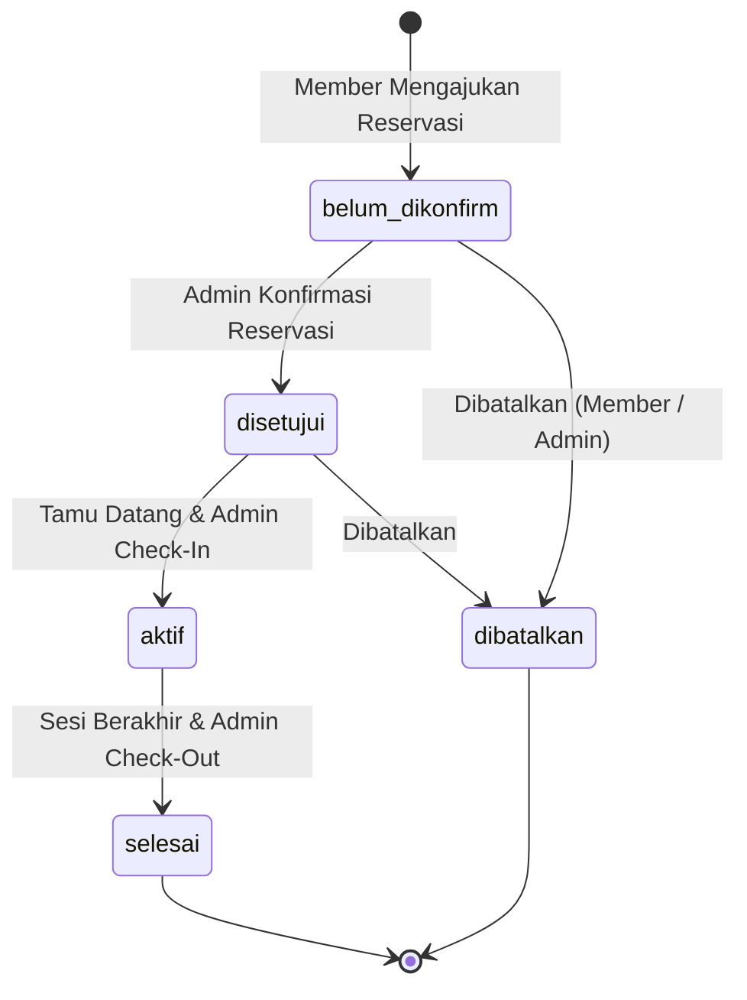

<div align="center">

# 🏢 Smart Space Booking
### Modern Coworking Space & Workstation Reservation Mobile Application

[](https://flutter.dev)
[](https://dart.dev)
[](https://riverpod.dev)
[]()
[]()
[]()

<br>

<p align="center">
  <b>Uji Kompetensi Keahlian (UKK) Rekayasa Perangkat Lunak 2026/2027</b><br>
  <b>SMK Telkom Malang — Paket B: Smart Coworking Space Booking</b>
</p>

[Fitur Utama](#-fitur-utama) •
[Alur Status](#-siklus-status-reservasi) •
[Arsitektur](#️-arsitektur--struktur-folder) •
[Matriks API (50 Endpoint)](#-matriks-kontrak-api-50-endpoint) •
[Instalasi & Build](#-panduan-instalasi--build-apk) •
[Keamanan](#-keamanan--multi-tenancy)

---

</div>

## 📖 Latar Belakang & Masalah

Pengelolaan reservasi coworking space dan workstation secara konvensional seringkali menghadapi berbagai kendala:
1. **Bentrok Jadwal (*Double Booking*)**: Tidak tersedianya validasi slot ketersediaan meja/ruangan secara *real-time* sebelum pemesanan diajukan.
2. **Ketiadaan Bukti Sah yang Terverifikasi**: Tamu kesulitan membuktikan reservasi sah di resepsionis tanpa sistem tiket digital berbasis QR Code.
3. **Pencatatan Finansial Manual**: Pengelola kesulitan menghitung estimasi omzet, potongan voucher diskon, dan realisasi pendapatan bersih per jenis ruangan.

**Smart Space Booking** hadir sebagai solusi komprehensif *client-server* lintas peran (**Member** & **Admin Pengelola Space**) yang mengintegrasikan validasi slot waktu dinamis, autentikasi multi-tenant dengan `x-maker-key`, tiket digital QR Code, serta modul laporan keuangan otomatis.

---

## ✨ Fitur Utama

### 1. 👤 Modul Member (Penyewa / Tamu)
* **Katalog Ruangan Dinamis**: Eksplorasi beragam tipe ruangan (*Personal Desk*, *Meeting Room*, *Private Office*) lengkap dengan foto, kapasitas, tarif per jam, dan fasilitas.
* **Pencarian & Filter Cepat**: Filter berbasis kategori dan kata kunci secara instan.
* **Validasi Ketersediaan Real-Time**: Pemeriksaan otomatis ketersediaan slot tanggal, jam mulai, dan durasi sewa ke server sebelum pemesanan diproses (`/api/spaces/availability`).
* **Kalkulasi Biaya & Voucher Diskon**: Masukkan kode kupon promo (`/api/diskon/check`), kalkulasi subtotal, potongan diskon, dan total bayar transparan.
* **Pelacakan Status 5 Fase**: Pantau status pemesanan secara langsung (*Menunggu Konfirmasi*, *Disetujui*, *Aktif/Check-in*, *Selesai*, *Dibatalkan*).
* **Tiket Digital (E-Ticket) dengan QR Code**: Tiket digital resmi berfitur kode booking dan QR Code untuk dipindai saat tiba di lokasi.
* **Histori Pemesanan & Filter Bulanan**: Arsip riwayat reservasi lengkap dengan pemilih bulan/tahun dan ringkasan pengeluaran bulanan.
* **Profil Member Premium**: Kartu identitas, informasi akun, navigasi cepat, dan statistik pemakaian akumulatif (*Total Booking*, *Total Jam*, *Total Pengeluaran*).

### 2. 🛡️ Modul Admin (Pengelola Coworking Space)
* **Dashboard Operasional Harian**: Ringkasan jumlah transaksi aktif, pending, selesai, dan reservasi hari ini.
* **Master Data Member (CRUD Penuh)**: Tambah member baru, cari member, perbarui profil/kontak/instansi, dan hapus akun.
* **Master Data Space (CRUD Penuh + Upload Foto)**: Kelola inventaris ruangan, konfigurasi kapasitas, tarif per jam, deskripsi fasilitas, serta upload foto via endpoint multipart (`/api/upload/spaces`).
* **Master Data Diskon / Promo (CRUD Penuh)**: Rancang kode kupon, tentukan persentase diskon, dan atur rentang masa berlaku (`tanggal_awal` hingga `tanggal_akhir`).
* **Operasional Check-In & Check-Out**:
  * Konfirmasi / tolak reservasi baru (`PATCH /api/admin/reservasi/:id/status`).
  * Aksi **Check-In** pelanggan saat tiba di lokasi (`POST /api/admin/reservasi/:id/check-in`).
  * Aksi **Check-Out** saat sesi sewa berakhir (`POST /api/admin/reservasi/:id/check-out`) dengan dialog konfirmasi aman.
* **Laporan Finansial Bulanan Komprehensif**:
  * Estimasi Pendapatan Kotor
  * Total Potongan Diskon
  * Realisasi Pendapatan Bersih
  * Total Booking & Akumulasi Durasi Jam
  * Distribusi Pendapatan per Tipe Ruangan (*Personal Desk*, *Meeting Room*, *Private Office*) dengan visualisasi bar proporsional.
* **Profil Lokasi Coworking**: Kelola identitas nama coworking, nama penanggung jawab, kontak telepon, dan alamat operasional.

---

## 🔄 Siklus Status Reservasi

Alur status pemesanan dikelola secara ketat dengan aturan transisi status sesuai ketentuan UKK:



| Status Reservasi | Label di UI | Warna Badge | Aksi yang Diizinkan |
|---|---|---|---|
| `belum_dikonfirm` | **Menunggu** | 🟡 Kuning Amber | Member/Admin dapat membatalkan, Admin dapat menyetujui |
| `disetujui` | **Disetujui** | 🔵 Biru Info | Tiket digital aktif, Admin dapat melakukan **Check-In** |
| `aktif` | **Sedang Digunakan** | 🟢 Hijau Emerald | Tamu berada di ruangan, Admin dapat melakukan **Check-Out** |
| `selesai` | **Selesai** | ⚪ Slate Gray | Sesi pemesanan selesai, tercatat di laporan finansial |
| `dibatalkan` | **Dibatalkan** | 🔴 Merah Crimson | Pemesanan hangus, tidak dihitung pada realisasi pendapatan |

---

## 🏗️ Arsitektur & Struktur Folder

Aplikasi dirancang dengan standar **Clean Architecture (Feature-First)** yang memisahkan kode menjadi lapisan **Domain**, **Data**, dan **Presentation**:

```
lib/
├── core/                                    # Fondasi & Utilitas Global
│   ├── errors/                              # ExceptionMapper & Failure Handling
│   ├── network/                             # DioClient, ApiEndpoints, & ApiHeaderInterceptor
│   ├── router/                              # GoRouter dengan Role Guard (Member / Admin)
│   ├── storage/                             # SecureStorageService (Encrypted Keystore/Keychain)
│   ├── theme/                               # AppColors, AppTypography, AppSpacing, & AppTheme
│   ├── utils/                               # CurrencyFormatter (Rupiah) & DateFormatter
│   └── widgets/                             # StatusBadge, AppShimmer, Dialogs
│
├── features/                                # Modul Berbasis Fitur (Feature-First)
│   ├── auth/                                # Autentikasi & Registrasi
│   │   ├── data/datasources/                # AuthRemoteDataSource (Login, Register Member/Admin)
│   │   ├── data/models/                     # UserModel, UserSession, DTO Requests
│   │   ├── domain/repositories/             # AuthRepository Interface & Implementation
│   │   └── presentation/                    # LoginScreen, RegisterMemberScreen, AuthController
│   │
│   ├── spaces/                              # Katalog & Booking Space
│   │   ├── data/datasources/                # SpacesRemoteDataSource (Spaces, Types, Availability, Promo)
│   │   ├── data/models/                     # SpaceModel, AvailabilityResult, PromoCheckResult
│   │   ├── domain/repositories/             # SpacesRepository
│   │   └── presentation/                    # SpacesCatalogScreen, SpaceDetailBookingScreen
│   │
│   ├── reservations/                        # Siklus Reservasi, Tiket & Histori
│   │   ├── data/datasources/                # ReservationsRemoteDataSource
│   │   ├── data/models/                     # ReservationModel, HistorySummary, ETicket
│   │   ├── domain/repositories/             # ReservationsRepository
│   │   └── presentation/                    # ReservationsStatusScreen, ETicketScreen, HistoryScreen
│   │
│   ├── member/                              # Shell & Akun Member
│   │   └── presentation/screens/            # MemberShellScreen (4-Tab BottomNav), MemberProfileScreen
│   │
│   └── admin/                               # Panel Pengelola Coworking
│       ├── data/datasources/                # AdminRemoteDataSource (CRUD Members, Spaces, Diskon, Laporan)
│       ├── data/models/                     # AdminProfileModel, AdminMemberModel, AdminReportModel
│       ├── domain/repositories/             # AdminRepository
│       └── presentation/                    # AdminShellScreen, AdminDashboard, AdminMonthlyReport, dll.
│
└── main.dart                                # Entry Point Aplikasi (ProviderScope + MaterialApp.router)
```

---

## 📡 Matriks Kontrak API (50 Endpoint)

Aplikasi telah diaudit dan **100% patuh** terhadap spesifikasi `Coworking_Space_API_UKK_PaketB.postman_collection (1).json`:

<details>
<summary><b>Lihat Seluruh 50 Endpoint yang Diimplementasikan (Klik untuk membuka)</b></summary>
<br>

| No | Modul / Folder | Method | URL Path | Fungsi di Aplikasi |
|:---:|---|:---:|---|---|
| **1** | `0. Root & Health` | `GET` | `/` | Cek status server |
| **2** | `0. Root & Health` | `GET` | `/health` | Health check endpoint |
| **3** | `1. App Maker` | `POST` | `/api/maker/register` | Pendaftaran App Maker tenant |
| **4** | `1. App Maker` | `POST` | `/api/maker/login` | Login App Maker tenant |
| **5** | `1. App Maker` | `GET` | `/api/maker/me` | Ambil profil App Maker aktif |
| **6** | `1. App Maker` | `GET` | `/api/maker/stats` | Statistik App Maker tenant |
| **7** | `1. App Maker` | `GET` | `/api/maker/list` | Daftar publik App Maker |
| **8** | `2. Autentikasi` | `POST` | `/api/auth/register/member` | Registrasi akun member baru |
| **9** | `2. Autentikasi` | `POST` | `/api/auth/register/admin-space` | Registrasi admin lokasi coworking |
| **10** | `2. Autentikasi` | `POST` | `/api/auth/login` | Login kredensial user & penerbitan token |
| **11** | `2. Autentikasi` | `GET` | `/api/auth/profile` | Ambil profil pengguna yang sedang login |
| **12** | `3. Space Coworking` | `GET` | `/api/spaces/types` | Mengambil daftar tipe ruangan yang tersedia |
| **13** | `3. Space Coworking` | `GET` | `/api/spaces/availability` | Validasi slot ketersediaan ruangan real-time |
| **14** | `3. Space Coworking` | `GET` | `/api/spaces` | Mengambil katalog ruangan (filter search & tipe) |
| **15** | `3. Space Coworking` | `GET` | `/api/spaces/:id` | Detail spesifik ruangan berdasarkan ID |
| **16** | `4. Diskon & Promo` | `GET` | `/api/diskon/active` | Mengambil daftar kupon diskon aktif |
| **17** | `4. Diskon & Promo` | `POST` | `/api/diskon/check` | Validasi kode promo sebelum checkout |
| **18** | `4. Diskon & Promo` | `GET` | `/api/diskon/:id` | Mengambil detail kupon diskon berdasarkan ID |
| **19** | `5. Reservasi Member` | `POST` | `/api/reservasi` | Membuat pengajuan reservasi baru |
| **20** | `5. Reservasi Member` | `GET` | `/api/reservasi/my` | Daftar seluruh reservasi milik member |
| **21** | `5. Reservasi Member` | `GET` | `/api/reservasi/my/history` | Riwayat transaksi member bulanan |
| **22** | `5. Reservasi Member` | `GET` | `/api/reservasi/:id/e-ticket` | Penerbitan data e-ticket digital & QR code |
| **23** | `5. Reservasi Member` | `GET` | `/api/reservasi/:id` | Detail lengkap satu data reservasi |
| **24** | `5. Reservasi Member` | `PATCH` | `/api/reservasi/:id/cancel` | Pembatalan reservasi oleh member |
| **25** | `6. Profil Lokasi Admin`| `GET` | `/api/admin/profile` | Mengambil data profil lokasi coworking |
| **26** | `6. Profil Lokasi Admin`| `PUT` | `/api/admin/profile` | Memperbarui profil lokasi coworking |
| **27** | `7. Manajemen Member` | `GET` | `/api/admin/members` | Mengambil daftar seluruh member terdaftar |
| **28** | `7. Manajemen Member` | `POST` | `/api/admin/members` | Menambahkan member baru dari admin |
| **29** | `7. Manajemen Member` | `GET` | `/api/admin/members/:id` | Detail data member berdasarkan ID |
| **30** | `7. Manajemen Member` | `PUT` | `/api/admin/members/:id` | Memperbarui profil member oleh admin |
| **31** | `7. Manajemen Member` | `DELETE`| `/api/admin/members/:id` | Menghapus akun member |
| **32** | `8. Manajemen Space` | `GET` | `/api/admin/spaces` | Mengambil inventaris seluruh ruangan |
| **33** | `8. Manajemen Space` | `POST` | `/api/admin/spaces` | Menambahkan ruangan / meja baru |
| **34** | `8. Manajemen Space` | `GET` | `/api/admin/spaces/:id` | Detail inventaris ruangan berdasarkan ID |
| **35** | `8. Manajemen Space` | `PUT` | `/api/admin/spaces/:id` | Memperbarui ruangan / tarif / fasilitas |
| **36** | `8. Manajemen Space` | `DELETE`| `/api/admin/spaces/:id` | Menghapus ruangan dari inventaris |
| **37** | `9. Manajemen Diskon` | `GET` | `/api/admin/diskon` | Mengambil daftar seluruh kupon diskon |
| **38** | `9. Manajemen Diskon` | `POST` | `/api/admin/diskon` | Membuat kupon diskon / voucher baru |
| **39** | `9. Manajemen Diskon` | `GET` | `/api/admin/diskon/:id` | Mengambil detail kupon diskon admin |
| **40** | `9. Manajemen Diskon` | `PUT` | `/api/admin/diskon/:id` | Memperbarui besaran / masa berlaku diskon |
| **41** | `9. Manajemen Diskon` | `DELETE`| `/api/admin/diskon/:id` | Menghapus kupon diskon |
| **42** | `10. Operasional Reservasi`| `GET` | `/api/admin/reservasi` | Filter seluruh data reservasi di coworking |
| **43** | `10. Operasional Reservasi`| `PATCH` | `/api/admin/reservasi/:id/status`| Konfirmasi atau tolak status reservasi |
| **44** | `10. Operasional Reservasi`| `POST` | `/api/admin/reservasi/:id/check-in` | Aksi Check-In pelanggan di lokasi |
| **45** | `10. Operasional Reservasi`| `POST` | `/api/admin/reservasi/:id/check-out`| Aksi Check-Out saat durasi sewa selesai |
| **46** | `11. Laporan Pendapatan`| `GET` | `/api/admin/reports/monthly` | Laporan pendapatan bulanan & distribusi |
| **47** | `11. Laporan Pendapatan`| `GET` | `/api/admin/reports/income` | Ringkasan omzet / pendapatan (alias) |
| **48** | `12. Upload Media` | `POST` | `/api/upload/image` | Unggah gambar umum (multipart) |
| **49** | `12. Upload Media` | `POST` | `/api/upload/spaces` | Unggah foto ruangan coworking (multipart) |
| **50** | `12. Upload Media` | `POST` | `/api/upload/members` | Unggah foto profil pengguna (multipart) |

</details>

---

## 🎨 Sistem Desain & Visual

Antarmuka dirancang modern, ergonomis, dan mengedepankan keterbacaan tinggi:

```
Palette Utama:
┌─────────────────────────┐  ┌─────────────────────────┐  ┌─────────────────────────┐
│         Primary         │  │     Deep Teal Dark      │  │        Surface 50       │
│         #0E7C6B         │  │         #0A5C50         │  │         #FAF9F7         │
└─────────────────────────┘  └─────────────────────────┘  └─────────────────────────┘
```

* **Color Tokens**:
  * **Primary Teal** (`#0E7C6B`): Identitas warna utama aplikasi yang memberikan impresi profesional.
  * **Surface 50** (`#FAF9F7`): Latar belakang *off-white* hangat yang nyaman di mata untuk penggunaan jangka panjang.
  * **Status Semantics**: Amber untuk menunggu (`#D97706`), Biru untuk disetujui (`#2563EB`), Hijau untuk aktif (`#059669`), Merah untuk batal/bahaya (`#DC2626`).
* **Tipografi**: Menggunakan **Sora** untuk judul dan identitas visual, serta **Inter** untuk keterbacaan data finansial tabular.
* **Komponen & Mikro-Interaksi**: Dilengkapi *skeleton shimmer loading*, *smooth tab transitions*, *hero gradient panels*, dan dialog konfirmasi dua langkah.

---

## 🔐 Keamanan & Multi-Tenancy

1. **Multi-Tenancy Guard (`x-maker-key`)**:
   Aplikasi mendukung sistem isolasi database multi-tenant. Setiap request ke server otomatis menyertakan header `x-maker-key` melalui [`ApiHeaderInterceptor`](lib/core/network/api_header_interceptor.dart).
2. **Penyimpanan Sesi Aman**:
   Token JWT dan kredensial sensitif disimpan menggunakan [`flutter_secure_storage`](https://pub.dev/packages/flutter_secure_storage) yang memanfaatkan enkripsi perangkat keras (**Android Keystore** dan **iOS Keychain**).
3. **Session Expiry Handler (401 Interceptor)**:
   Jika sesi pengguna kedaluwarsa atau token tidak valid, interceptor otomatis membersihkan sesi lokal dan mengarahkan pengguna kembali ke layar login tanpa menyebabkan aplikasi crash.
4. **Role-Based Access Control**:
   Navigasi dilindungi oleh `GoRouter` redirect guards, memastikan member tidak dapat mengakses portal admin, dan sebaliknya.

---

## 🚀 Panduan Instalasi & Build APK

### Prasyarat Perangkat
- [Flutter SDK](https://flutter.dev/docs/get-started/install) versi `>=3.38.7`
- [Dart SDK](https://dart.dev) versi `>=3.10.7`
- JDK 17 atau yang kompatibel dengan Android Gradle Plugin
- Android Studio / VS Code dengan plugin Flutter

### Langkah Menjalankan Aplikasi

1. **Clone repositori**:
   ```bash
   git clone https://github.com/username/bookingworkroom.git
   cd bookingworkroom
   ```

2. **Unduh seluruh dependensi**:
   ```bash
   flutter pub get
   ```

3. **Konfigurasi Base URL & App Key**:
   Buka file [`lib/core/network/api_endpoints.dart`](lib/core/network/api_endpoints.dart) dan pastikan `baseUrl` mengarah ke server API panitia:
   ```dart
   static String baseUrl = 'https://learn.smktelkom-mlg.sch.id/coworking';
   // atau untuk server lokal: 'http://10.0.2.2:3000' (Emulator) / 'http://localhost:3000' (Windows)
   ```

4. **Jalankan aplikasi di perangkat / emulator**:
   ```bash
   flutter run
   ```

### 📦 Menghasilkan File APK Rilis (Release APK)

Untuk menghasilkan file APK siap pasang pada perangkat Android untuk pengujian:

```bash
# Build APK rilis (arsitektur universal)
flutter build apk --release

# Atau split per arsitektur ABI untuk ukuran file lebih kecil:
flutter build apk --split-per-abi
```

Hasil file APK akan berada di direktori:
```
build/app/outputs/flutter-apk/app-release.apk
```

---

## 🧪 Verifikasi Kode & Analisis Kualitas

Proyek ini dipelihara dengan standar kode yang ketat dan bebas dari *warning/error* linting:

```bash
# Menjalankan static code analyzer (0 issues)
flutter analyze

# Menjalankan seluruh pengujian otomatis
flutter test
```

---

<div align="center">
  <sub>Dibangun dengan dedikasi untuk Uji Kompetensi Keahlian (UKK) Rekayasa Perangkat Lunak 2026/2027</sub><br>
  <sub><b>SMK Telkom Malang</b></sub>
</div>
