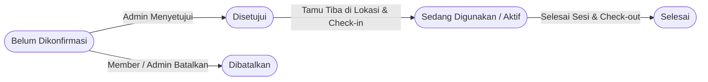

<div align="center">

# 🏢 Smart Space Booking
### Aplikasi Reservasi Coworking Space & Workstation (Mobile App)

[](https://flutter.dev)
[](https://dart.dev)
[](https://riverpod.dev)
[]()
[]()

<p align="center">
  <b>Uji Kompetensi Keahlian (UKK) Rekayasa Perangkat Lunak 2026/2027</b><br>
  SMK Telkom Malang — Paket B (Lampiran D)
</p>

---

</div>

## 📌 Daftar Isi
- [📖 Latar Belakang & Masalah](#-latar-belakang--masalah)
- [✨ Fitur Utama](#-fitur-utama)
  - [1. Modul Member (7 Layar)](#1-modul-member-7-layar)
  - [2. Modul Admin / Pengelola Space (9 Layar)](#2-modul-admin--pengelola-space-9-layar)
- [🔄 Siklus Status Reservasi](#-siklus-status-reservasi)
- [🏗️ Arsitektur & Struktur Folder](#️-arsitektur--struktur-folder)
- [🎨 Sistem Desain (UI/UX)](#-sistem-desain-uiux)
- [🚀 Panduan Memulai (Getting Started)](#-panduan-memulai-getting-started)
- [🧪 Pengujian & Analisis Kode](#-pengujian--analisis-kode)
- [🔐 Keamanan & Multi-Tenancy](#-keamanan--multi-tenancy)

---

## 📖 Latar Belakang & Masalah

Pengelolaan penyewaan coworking space konvensional seringkali menimbulkan kendala seperti:
1. **Bentrok Jadwal (Double Booking)** akibat ketersediaan ruangan/meja yang tidak real-time.
2. **Ketiadaan Bukti Reservasi Sah** yang menyulitkan verifikasi tamu saat check-in di meja resepsionis.
3. **Pencatatan Finansial Manual** yang menyulitkan pelacakan pendapatan per jenis ruangan per bulan.

**Smart Space Booking** hadir sebagai solusi aplikasi mobile *client-server* dua-peran (**Member** & **Admin**) dengan validasi jadwal otomatis sebelum reservasi dibuat, bukti e-ticket dengan QR Code, serta rekapitulasi finansial otomatis.

---

## ✨ Fitur Utama

### 1. Modul Member (7 Layar)
* **M1 — Register Akun Member**: Pendaftaran pengguna baru dengan upload foto profil (`image_picker` $\rightarrow$ `/api/upload/members`).
* **M2 — Login Member**: Autentikasi JWT dengan penyimpanan sesi aman di Android Keystore.
* **M3 — Katalog Space (Beranda)**: Eksplorasi katalog ruangan (*Personal Desk*, *Meeting Room*, *Private Office*), pencarian teks, dan filter kategori.
* **M4 — Pesan Space & Cek Ketersediaan**:
  * Pengecekan ketersediaan slot tanggal & jam secara real-time sebelum submit.
  * Validasi kode voucher promo (`/api/diskon/check`) dan kalkulasi rincian harga.
* **M5 — Status Pemesanan**: Pemantauan status 5 siklus pemesanan secara langsung dan opsi pembatalan reservasi.
* **M6 — Histori Pemesanan**: Rekapitulasi histori transaksi dan total pengeluaran per bulan.
* **M7 — E-Ticket / Bukti Reservasi**: Render QR Code mandiri dari data reservasi untuk validasi saat check-in di lokasi.

### 2. Modul Admin / Pengelola Space (9 Layar)
* **A1 — Register Admin/Lokasi**: Pendaftaran lokasi coworking space baru dan akun penanggung jawab.
* **A2 — Login Admin**: Akses portal pengelola space.
* **A3 — Profil Lokasi**: Pembaruan identitas coworking (nama, kontak, alamat, deskripsi fasilitas).
* **A4 — Master Data Member (CRUD)**: Kelola data pelanggan beserta foto profil.
* **A5 — Master Data Space (CRUD)**: Kelola inventaris ruangan/meja (tipe, kapasitas, harga per jam, fasilitas, foto).
* **A6 — Master Data Promo/Diskon (CRUD)**: Kelola kode voucher, persentase diskon, dan rentang masa berlaku.
* **A7 — Operasional Reservasi (Detail & Aksi)**: 
  * Aksi **Check-in** (mengubah status ke `aktif`).
  * Aksi **Check-out** (mengubah status ke `selesai`) dengan dialog konfirmasi keamanan 2 langkah.
* **A8 — Semua Reservasi (Filter)**: Filter data pemesanan berdasarkan status, bulan, dan jenis space.
* **A9 — Rekapitulasi Pendapatan Bulanan**: Laporan finansial otomatis (pendapatan kotor, potongan diskon, pendapatan bersih, dan distribusi per tipe space).

---

## 🔄 Siklus Status Reservasi

Alur status reservasi ditangani secara ketat mengikuti kontrak API backend:



---

## 🏗️ Arsitektur & Struktur Folder

Proyek ini dibangun menggunakan **Clean Architecture (Feature-First)** untuk memastikan pemisahan tanggung jawab (*separation of concerns*), skalabilitas, dan kemudahan pengujian:

```
lib/
├── core/                              # Fondasi lintas fitur
│   ├── errors/                        # Failure & ExceptionMapper terstruktur
│   ├── network/                       # DioClient, ApiEndpoints, & ApiHeaderInterceptor
│   ├── router/                        # GoRouter deklaratif dengan role-based route guard
│   ├── storage/                       # SecureStorageService (Encrypted Keystore)
│   ├── theme/                         # AppColors, AppTypography, AppSpacing, & AppTheme
│   ├── utils/                         # CurrencyFormatter & DateFormatter
│   └── widgets/                       # StatusBadge, AppShimmer loading skeleton
│
├── features/                          # Modul berbasis fitur
│   ├── auth/                          # Modul Autentikasi (Member & Admin)
│   │   ├── data/                      # Models (DTO) & AuthRemoteDataSource
│   │   ├── domain/                    # AuthRepository & UserSession Entity
│   │   └── presentation/              # AuthController (Riverpod) & Layar (Login, Register)
│   ├── member/                        # Shell & Fitur Member
│   └── admin/                         # Shell & Fitur Pengelola Space
│
└── main.dart                          # Entry point aplikasi (ProviderScope + MaterialApp.router)
```

---

## 🎨 Sistem Desain (UI/UX)

Mengadopsi antarmuka modern yang hangat dan profesional berdasarkan spesifikasi desain:

| Elemen | Spesifikasi |
|---|---|
| **Warna Utama** | `Ember` (**#C2540E**) untuk aksi Member & `Deep Teal` (**#0E5C56**) untuk Pengelola |
| **Warna Latar** | `Surface-50` (**#FAF9F7**) warm off-white lembut di mata |
| **Warna Status** | `Warning` (#B8860B), `Info` (#1D6FA5), `Success` (#2F7A4D), `Danger` (#B3261E) |
| **Tipografi** | **Sora** (Headings & Labels) + **Inter** (Body & Finansial Tabular Numbers) |
| **Corner Radius** | `12dp` (Tombol), `16dp` (Kartu Konten), `24dp` (Bottom Sheet), `999dp` (Pill Badge) |
| **Status Badge** | Desain Pill dengan kombinasi **Ikon + Warna Latar Transparan + Teks** (Aksesibilitas AA) |

---

## 🚀 Panduan Memulai (Getting Started)

### Prasyarat
- [Flutter SDK](https://flutter.dev/docs/get-started/install) (versi `^3.38.7` atau stabil terbaru)
- [Dart SDK](https://dart.dev) (versi `^3.10.7`)
- Android Studio / VS Code dengan ekstensi Flutter & Dart

### Langkah Instalasi

1. **Clone repositori**:
   ```bash
   git clone https://github.com/username/bookingworkroom.git
   cd bookingworkroom
   ```

2. **Pasang dependensi**:
   ```bash
   flutter pub get
   ```

3. **Konfigurasi Base URL API**:
   Buka file [`lib/core/network/api_endpoints.dart`](lib/core/network/api_endpoints.dart) dan sesuaikan konstanta `baseUrl`:
   ```dart
   // Contoh untuk emulator Android:
   static String baseUrl = 'http://10.0.2.2:8000';
   ```

4. **Jalankan aplikasi**:
   ```bash
   flutter run
   ```

---

## 🧪 Pengujian & Analisis Kode

Aplikasi dilengkapi dengan pengujian unit/widget dan pemeriksaan lint bebas peringatan:

```bash
# Menjalankan static code analysis
flutter analyze

# Menjalankan seluruh test suite
flutter test
```

---

## 🔐 Keamanan & Multi-Tenancy

1. **Penyimpanan Terenkripsi**: Token JWT dan `app_key` disimpan menggunakan `flutter_secure_storage` yang terenkripsi di *Hardware-backed Android Keystore*.
2. **Interceptor Terpusat**: Header `x-maker-key` (isolasi multi-tenancy) dan `Authorization: Bearer <token>` disisipkan secara otomatis oleh `ApiHeaderInterceptor`.
3. **Route Guard**: `GoRouter` secara otomatis mencegah pengguna yang belum terautentikasi atau role yang tidak sesuai mengakses rute terlarang.

---

<div align="center">
  <sub>Dibangun dengan ❤️ untuk UKK RPL 2026/2027 SMK Telkom Malang</sub>
</div>
